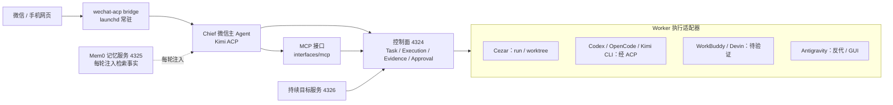
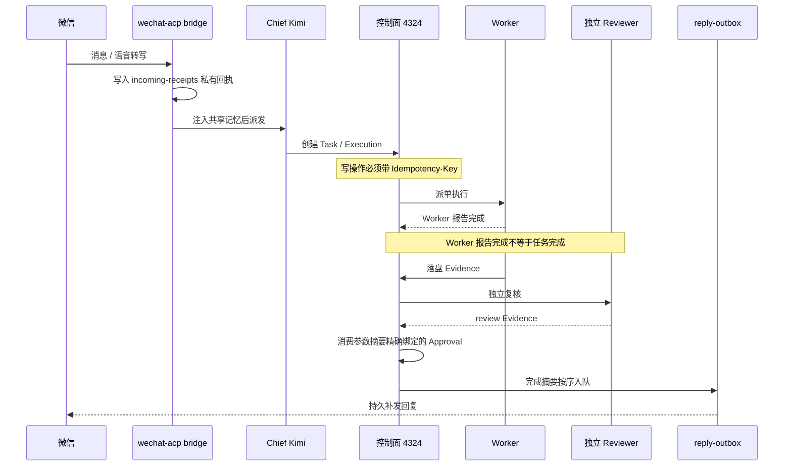
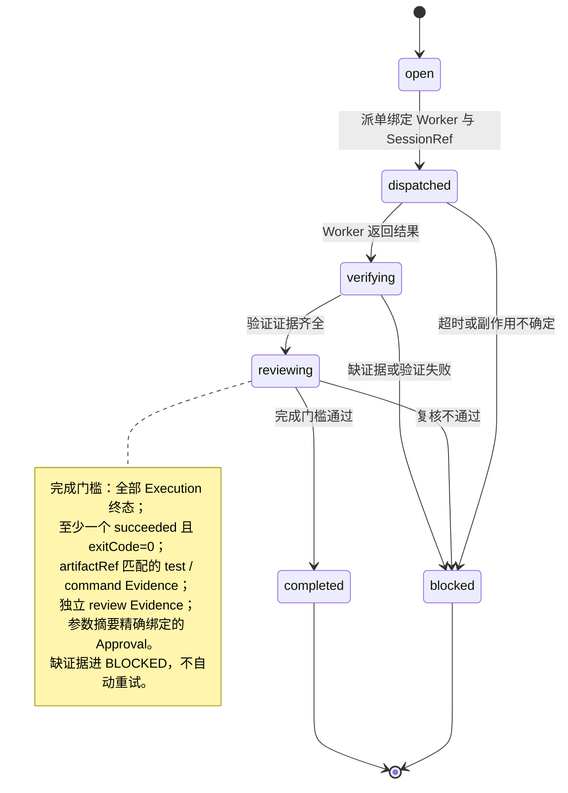

<div align="center">

<picture>
  <source media="(prefers-color-scheme: dark)" srcset="docs/img/logo-dark.svg">
  
</picture>

# Personal AI OS

macOS 本机 AI 调度控制面：可审计的执行与证据闭环。


**[架构设计 v1.2](personal_ai_os_wechat_mac_agent_architecture_v1.html)** · **[执行记录](EXECUTION.md)** · **[0.3.0 计划](docs/plans/0.3.0-execution.md)** · **[思路与致谢](#思路与致谢)**

</div>

## 简介

Personal AI OS 是跑在 macOS 上的 AI 调度控制面。微信是移动入口，Cezar（4321）是本地 cockpit，控制面（4324）负责 Task、Execution、Evidence、Approval 这些可审计对象；Worker 可插拔——Cezar、Codex、OpenCode、Kimi CLI、WorkBuddy、Devin、Claude Code、Antigravity。Git 仓库已命名为 personal-ai-os，本地目录与 launchd 标签随 0.3.0 发布时迁移（见[命名决策](docs/decisions/rename-personal-ai-os.md)）。

它不把所有 App 的历史复制进一个新数据库，也不给每个 GUI App 贴"已支持"的标签。控制面只写自己的状态文件（`readOnly=true`、`secretsRead=false`、`messageBodiesRead=false`），不写外部 Agent 的历史；发现了某个 Agent 的可执行文件，不等于旧会话可以安全恢复。

## 为什么是 Personal AI OS

你大概率同时用着多个 AI Agent：Codex、Claude Code、Kimi、OpenCode、Devin……每个 Agent 有自己的会话格式、配置和记忆，彼此互不往来，于是一些麻烦反复出现：

- **配置割据** —— 模型、key、provider 列表分散在各 Agent 的配置里，换一家供应商就改一遍；
- **记忆不共享** —— 在这个 Agent 里讲清的个人背景，换个 Agent 要从头再说；
- **历史锁死** —— 旧会话困在各自的私有格式里，能不能恢复、如何恢复，没有可验证的答案；
- **完成不可信** —— Agent 说"做完了"没有证据，测试、复核、审计一概缺失；
- **入口缺失** —— 人离开电脑，本机 Agent 一律够不着；
- **断线靠人盯** —— 长任务超时或重启，要么从头再来，要么靠人守着重试；
- **审核跟不上** —— Agent 一天能产出几百行改动、十几个 PR，逐行审的人才是瓶颈：要么累死，要么闭眼全过。

单看都是小麻烦，合起来的代价是：你得守在工位上，亲自当调度员、记忆库和验收员。

Personal AI OS 要把这三个角色接过去。一个人加上这套系统，相当于一支专业而高效的团队——任务有台账、背景有记忆、交付有复核。AI 跑得再快，你也不用逐步盯：证据链机器先过，你只签不可逆的那几个字。任务在跑的时候，你可以在咖啡店、在山顶、在任何有手机信号的地方推进它、记下灵感，而不是把自己钉在办公室里。

它的回答是：不迁移、不复制任何 App 的历史，而是立一个可审计的控制面，把派单、记忆、验证和入口统一管起来。断线有巡检补发，"做完"要过证据关，批准精确绑定——你离开的是工位，不是控制。

## 能力一览

上面的每一条，都对应专业团队里的一个角色：台账是项目经理，记忆是团队知识库，门槛是测试与复核，入口是随时在线的协作频道。你一个人，带着这支团队。AI 出活越快，人越审不完，所以门槛由机器和独立复核先跑完，你的签字只留给不可逆的动作（见[审核如何跟上 AI 的速度](#审核如何跟上-ai-的速度)）。

<table>
<tr>
<td width="33%" valign="top">

**📋 一份 Task 账本** — 派单、状态、证据、审批全部落盘可审计。

</td>
<td width="33%" valign="top">

**🧠 一份共享记忆** — 微信与 Chief 共用 Mem0 检索事实，换 fallback 不换命名空间。

</td>
<td width="33%" valign="top">

**🔍 一次诚实的发现** — 只读索引各 Agent 会话元数据；恢复只给未验证计划。

</td>
</tr>
<tr>
<td valign="top">

**✅ 一道完成门槛** — 测试证据、独立复核、精确审批缺一不可。

</td>
<td valign="top">

**📱 一个微信入口** — 手机派任务、查进度、批审批；断线自动巡检补发。

</td>
<td width="33%" valign="top">

**🧩 一组可插拔 Worker** — Cezar、Codex、OpenCode、Kimi CLI 经统一适配器接入。

</td>
</tr>
</table>

## 系统架构



控制面默认只监听 `127.0.0.1`。写操作都要幂等键，Cezar 派单还要一条动作、目标、参数摘要完全对得上的审批。MCP 工具层只创建控制面对象，不直接启动外部 Agent。

### 一条消息的一生



回执先落盘再推进游标；回复按顺序投递，重启不丢待发文本；微信服务器不保证 exactly-once，发送接口接受也不等于用户已读。

### 什么才算"做完了"



Worker 说"做完了"不算数。允许 `completed` 之前必须凑齐：全部 Execution 进入终态、至少一个 `succeeded` 且 `exitCode=0`、同一 artifact 的 test/command 证据、另一条独立的 review 证据（Reviewer 只建可审计的 review child，不冒充 Worker 原上下文），最后消费一条精确绑定、没用过的 Approval。缺证据或副作用拿不准就进 `BLOCKED`，说清楚原因，不自动重试，也不伪造完成。

## 快速开始

```bash
cd /Users/markus/ai-agent-cockpit

# 启动尚未运行的本地入口（Cezar、微信控制、控制面、持续目标）
./scripts/start-local.sh

# 查看本机 Agent 会话元数据（只读）
npm run sessions
npm run sessions -- --json --provider=codex --limit=20
# 显式调用 Codex ACP session/list（只读，不 load、不 prompt）
npm run sessions -- sessions native-list --provider=codex --cwd="$PWD" --json

# 运行控制面契约与隐私边界测试
npm run test:control-plane

# 运行协议级回归评估（临时状态目录，不调用模型）
npm run eval:control-plane

# 一次性诊断 Cezar、微信、控制面、Mem0、Feature Map 和回归评估
npm run doctor

# 控制面健康检查
curl -fsS http://127.0.0.1:4324/health
```

## 本机一览

| 端口 | 组件 | launchd 标签 | 职责 |
| --- | --- | --- | --- |
| 4321 | Cezar cockpit | `com.markus.ai-agent-cockpit.cezar` | 本地任务、工作树与运行界面 |
| 4322 | 微信控制服务 | `com.markus.ai-agent-cockpit.wechat-control` | 二维码、登录状态与 bridge 启动控制 |
| 4323 | Kimi shim | `com.markus.ai-agent-cockpit.kimi-shim` | 本机 provider 反代 |
| 4324 | Personal AI OS 控制面 | `com.markus.ai-agent-cockpit.control-plane` | Task / Execution / Evidence / Approval |
| 4325 | Mem0 OSS 记忆服务 | `com.markus.personal-ai-os.memory` | 本地向量检索、持久入库队列 |
| 4326 | 持续目标服务 | `com.markus.personal-ai-os.goals` | 范围授权、租约、检查点、预算、自动返工 |
| — | 微信 ACP bridge | `com.markus.ai-agent-cockpit.wechat-bridge` | 微信 → Chief，失败/超时按配置顺序 fallback |
| — | Antigravity 反代 | `com.markus.antigravity-proxy` | Provider 反代 |
| — | keepawake | `com.markus.ai-agent-cockpit.keepawake` | 保持唤醒 |

都由 launchd 常驻，全部只监听回环地址；关掉浏览器不影响后台运行。

```text
control-plane/       Task / Execution / Evidence / Approval 契约、存储、路由、派单、原生 ACP 执行器
runtime/             RuntimePort、owner/契约 SQLite、Pi 适配器
gateway/             控制面 HTTP、持续目标服务、微信控制、Kimi shim
interfaces/mcp/      Chief 可用的 MCP 工具层
adapters/engines/    Worker 适配器（cezar.mjs）
services/memory/     Mem0 OSS FastAPI 适配层（service.py / quality.py / lifecycle.py）
vendor/cezar         Cezar cockpit 与 run/worktree 运行时
vendor/wechat-acp    微信 ACP 桥与收件/补发/归档
launchd/             常驻 XML 定义（cezar / bridge / control-plane / memory / goals ...）
config/              本机配置（wechat-acp.json、opencode fallback、runtime-versions）
scripts/             启动、诊断、迁移与 live 验证脚本
tests/               控制面、目标、记忆、权限与运行时测试
evals/               不调用模型的协议级回归评估
docs/                releases 版本说明、plans 计划、decisions、research
```

## 几个关键机制

### 微信入口与可靠投递

桥先把完整转写和消息元数据写进实例私有的 `incoming-receipts/`，再推进游标；超时后没开始的消息保留继续，恢复巡检每 5 秒跑一轮，失败的请求按 15/30 秒退避，三次不成转人工核对。要补发的文本进私有 `reply-outbox/`，按顺序投递，最多重试 96 次、退避到 15 分钟。微信里可以 `/approve`、`/reject`（或 `/批准`、`/拒绝`）审批，也可以 `/消息` 看队列、`/acp-more` 续补发、`/取消`、`/新会话`。边界直说：没有原始音频 ASR（依赖微信自己的转写）、前台处理上限 5 分钟、二进制附件不补发。细节见 [0.2.2 说明](docs/releases/0.2.2.md)。

### 共享记忆（Mem0 OSS）

每轮派发前统一注入人格规则、近期对话、较早的有损摘录和 Mem0 检索到的相关事实；换 fallback 不换记忆命名空间，完整正文追加到私有 `conversation-archive/`。存储和 embedding 在本机（Qdrant + SQLite，384 维多语言模型），目录在 `~/.local/state/personal-ai-os/mem0/`。旧版用 Kimi 生成式提炼，出现过事实缺失；现在的源码改由本机 `jev-eval` 调远程 Jev 选择和校验完整原文句子，Mem0 以 infer=False 原样存储——提炼不生成式改写，但也不是全离线。投递是 at-least-once，断电窗口不保证 exactly-once；永久拒绝的记录留在私有 `rejectedOutbox`。更正、擦除、原生上下文重置与正式部署仍未验收（[阶段台账](docs/plans/0.3.0-status.md)），运维见[记忆服务文档](services/memory/README.md)。

### 持续目标（goals 4326）

在仪表盘"持续目标 · 自主验证"创建草稿，看文件范围、不可修改的验收和 token 上限，确认了才启动。Kimi 规划/复核，官方 DeepSeek V4.1 Flash 提出修改，修改只落到私有副本，真实 `node --test` 验收在 macOS Seatbelt 下跑；失败了它自己返工，默认最多 3 次，不逐轮求人批。微信 `/目标` 可以抽查进度、暂停、恢复、取消。边界：确认范围要完整的 scope digest，聊天模型不能代批；只支持已有文本文件和固定 Node 验收；输入会发给既有 provider，不是全离线。详见 [0.2.0 说明](docs/releases/0.2.0.md)。

## Agent 接入现状

通讯平台是"用户入口"，下表的 CLI/App 是"执行 Worker"，两者不共用"已连接"的含义。最新阶段状态见[四类状态台账](docs/plans/0.3.0-status.md)。

| Agent | 会话元数据 | 原生恢复提示 | 目前限制 |
| --- | --- | --- | --- |
| Codex | SQLite + 显式ACP `session/list`只读索引 | load/resume能力已探测；历史一次选定session/load probe成功 | 不等于真实prompt/多Worker闭环；用户旧会话仍须精确范围 |
| Codex App | Feature Map独立来源，当前unknown | 与Codex CLI分开核对 | App占用、准确旧会话与GUI恢复未单独验收 |
| OpenCode | SQLite + ACP `session/list` 只读索引 | ACP load/resume capability 已实测 | 未执行 load、prompt 或消息读取 |
| Kimi CLI | `session_index.jsonl` + ACP `session/list` | ACP load/resume capability 已实测 | 新建隔离 ACP 会话的真实 prompt/记忆召回已通过；用户旧会话恢复仍未验收 |
| WorkBuddy | 已发现 App/`codebuddy --acp`，ACP initialize 成功 | 声明 loadSession/MCP，但未声明 session/list | 旧会话不能由控制面猜测或静默创建 |
| Devin | App/ACP `session/list` 已实测 | 声明 loadSession，未声明 resume | 真实 prompt、认证、load 和云端能力仍待验证 |
| Claude Code | 已发现本地入口 | 原生 session 机制 | 本版本不读取 `~/.claude` 历史 |
| Antigravity | 已发现 App/本机反代 | GUI-only / proxy | 没有稳定的本地旧会话索引 |
| DeepSeek Harness App | Feature Map独立来源，当前unknown | 尚无已验收的原生恢复通道 | 模型provider成功不能当作Harness App或旧对话已接通 |

## 接微信以外的通讯平台

当前只有微信在跑。其他平台可以复用微信桥的持久收件、补发、身份、记忆与验收规则，但认证和消息格式各家不同——"平台有 SDK"不等于已支持。

| 平台 | 当前项目状态 | 接入方向 / 边界 |
| --- | --- | --- |
| 微信（现有wechat-acp通道） | 已接入0.2.2，本轮connected | 二维码绑定、文字与服务器语音转写；新Pi后台联动待做 |
| 飞书 / Lark | 未接入，优先候选 | 官方SDK长连接bot；应用/租户授权与审批回调需单独验证 |
| WhatsApp | 未接入，候选 | 优先官方Business Cloud API/webhook；不默认接管个人客户端 |
| Telegram | 未接入，候选 | 官方Bot API长轮询或webhook；身份/游标/媒体逐项验 |
| Slack | 未接入，候选 | 官方bot/Socket Mode；不是只有单向通知webhook |
| Discord / 钉钉 / 企业微信 / Teams / LINE | 未接入，待专项调研 | 官方bot/应用候选；权限、收件与投递规则各自核对 |
| Signal / iMessage / QQ等个人客户端 | 未接入，暂不承诺默认支持 | 先确认可靠接口与账号边界，不把GUI外挂当稳定兼容 |
| 手机网页 | 未接入，研究在途 | Paseo 调查（[docs/research/](docs/research/paseo-2026-10-07.md)），候选跨平台入口 |

详细对比、官方依据和 ChannelPort 模板草案见[通讯平台兼容与接入模板](docs/plans/channel-compatibility.md)。模板还没编码，其他平台一个都没装过、登过、测过。桥的通用管线（收件、补发、记忆注入）能复用，但还没抽出平台无关的 transport 接口（现在和微信消息类型绑着）；第二个连接器没落地之前，"模板化成本"是估算，不是实测。

## 审核如何跟上 AI 的速度

AI 的执行速度一直在涨，人的审核速度不涨。每个动作都等人点头，人就成了系统里唯一的瓶颈——这不是解放，是换了个地方上班。

所以这套系统按风险分三档。沙箱里、可逆的、只读的动作，全自动：持续目标在私有副本里自己修、自己验、自己返工（默认最多 3 次），不逐轮求人批。可逆但要花外部成本的动作，机器把关：确定性测试、独立 AI 复核、证据落盘，人只抽查。不可逆或者越出授权边界的动作，才轮到人：动作、目标、参数摘要一一对上，一次授权只生效一次。

再往下放权还有两个方向。审批带额度——预授权一段有边界的自主空间（目录范围、token 预算、次数上限），像 sudo，不像门禁卡；异常才打扰——常规波动系统自己消化，越界、超预算、缺证据才举手。这两样现在都没有，排在 0.3.0 之后。今天系统在发起动作这层仍然逐次审批，是刻意的保守：放权跟着证据走，不跟着乐观走。

这套分档也是"一个人一支团队"能成立的前提：团队里的初级成员自查互查，人只签不可逆的那几个字。注意力是人最稀缺的资源，系统的规矩就是不浪费它。

## 在别的系统上能跑吗

控制面和适配器分层设计，平台相关的部分集中在三个边界：进程托管（launchd）、沙箱（Seatbelt）、本地判断二进制（jev-eval）。目前只在 macOS 上开发、测试、验证，其他平台没有开始，也不做承诺。

| 组件 | 技术栈 | 状态 |
| --- | --- | --- |
| 控制面 / 网关（4324 / 4326 / 4323） | Node.js 24 | macOS 已验证；跨平台天然，未验证 |
| wechat-acp 桥（微信 I/O） | Node.js + iLink 云 API | macOS 已验证；协议层与 OS 无关，未验证 |
| 微信控制服务（4322） | Node.js + iLink 云 API | macOS 已验证；协议层与 OS 无关，未验证 |
| Mem0 记忆服务（4325） | Python + Qdrant | macOS 已验证；跨平台天然，未验证 |
| 进程托管 | launchd | macOS 已验证；其他系统需 systemd 等替代实现 |
| 目标沙箱 | Seatbelt | macOS 已验证；其他系统需 bubblewrap / landlock 等替代 |
| 本地判断二进制 | jev-eval | 仅 macOS 构建 |

微信收发走腾讯 iLink 云端 Bot API（纯 HTTPS，代码里没有 AppleScript、没有辅助功能、不碰本地客户端），所以对操作系统的依赖只在部署层——launchd 托管和 caffeinate 保活。下一个候选是 Linux（systemd 替换最直接），Windows 可能走 WSL2，都没有时间表。

## 安全与隐私

五条原则：

1. Session 归原生 Agent 管，Task、Execution 和审计归控制面管；标题不能当会话身份，恢复必须绑定来源、profile、原生 ID 和工作目录。
2. Worker 报告完成，必须经过验证和独立 review，不能直接标成最终完成。
3. fallback 只在还没产生副作用的边界内执行；已有副作用的执行不会被静默重试。
4. 工作目录不是沙箱；接入失败不靠 bypass、自动批准或复制凭据来"修"。
5. 本机 Devin 和 Devin Cloud 是两个适配器；本机 ACP 握手成功不代表云端、认证、计费或旧会话恢复已经打通。

隐私底线：所有 HTTP 服务只听 `127.0.0.1`；写操作要幂等键；私有目录 0700、token/状态文件 0600；控制面只写自己的状态文件，不写外部 Agent 历史，不读认证文件和消息正文；token、API key、二维码登录状态不进 Git。控制面状态在 `~/.local/state/ai-agent-cockpit/control-plane.json`（命名批次 2 时迁移）。

## 测试与验证

| 命令 | 覆盖范围 |
| --- | --- |
| `npm run test:control-plane` | 控制面契约与 HTTP 边界 |
| `npm run eval:control-plane` | 协议回归，临时状态目录，不调用模型 |
| `npm run test:goals` | 目标范围、租约、预算、验收、返工与 Seatbelt 隔离 |
| `npm run test:runtime-tools` | 任务绑定的Pi查询/queued子执行/规划与权限拒绝；合成HTTP/SSE |
| `npm run test:runtime-recovery` | 真实SIGKILL测试进程与SDK safe/unsafe四组合；无原生派单 |
| `npm run test:kimi-shim` | loopback流式首帧、错误脱敏与HTTP边界；无真实认证 |
| `npm run runtime:tools-canary` | 默认faux，只读查询/保存答案/重开，零网络 |
| `npm run test:runtime-tools-live` | 临时loopback shim与真实Kimi只读查询，最多2轮；不重启生产 |
| `npm run test:memory-service` | 记忆服务鉴权、隔离、幂等、重试与权限 |
| `npm run test:voice-live` | 真实模型/真实服务，产生少量费用 |
| `npm run test:memory-live` | 真实 Mem0 + Kimi 中文提炼与检索，产生少量模型调用 |
| `npm run test:memory-kimi` | 真实 Kimi ACP 使用注入记忆，不发送真实微信消息 |
| `npm run test:memory-quality-live` | 真实 Jev + Mem0 隔离质量检查，产生少量调用 |
| `npm run test:memory-recovery` | macOS 实际停启 Mem0，验证降级与回放 |
| `npm run test:goals-live` | 真实 Kimi/DeepSeek 合成修复试运行，产生少量模型费用 |
| `npm run test:goal-recovery-live` | 真实提案后中断、检查点接续、真实验收与独立复核 |

带 `-live` 的脚本会调用真实模型或真实服务，产生少量费用，建议在相应阶段的合成命名空间与预算内运行。

最近的隔离证据：运行层 87 项、权限 27 项、控制面 21 项、Goal 60 项、Kimi shim 9 项全部通过；受控工具仍只查询和排队，不派单、不审批、不写文件；生产仍为 0.2.2/legacy。详见[运行时决策](docs/decisions/runtime-0.3.0.md)。

## 文档导航

| 文档 | 内容 |
| --- | --- |
| [0.2.0](docs/releases/0.2.0.md) · [0.2.1](docs/releases/0.2.1.md) · [0.2.2](docs/releases/0.2.2.md) | 三个版本的机制、验证与边界 |
| [0.3.0 升级方案](docs/plans/0.3.0-upgrade.md) · [执行计划](docs/plans/0.3.0-execution.md) · [验收矩阵](docs/plans/0.3.0-validation.md) · [裁剪清单](docs/plans/0.3.0-pruning.md) · [可视化概览](docs/plans/0.3.0-overview.html) | 0.3.0 边界、实施与退出条件 |
| [运行时决策](docs/decisions/runtime-0.3.0.md) | P0/P1/P2 证据与决定 |
| [阶段台账](docs/plans/0.3.0-status.md) · [四类状态可视化](docs/plans/0.3.0-overview.html) | 已完成、正在推进、待办、待测试验证；名称/现场与证据日期 |
| [通讯平台兼容表](docs/plans/channel-compatibility.md) | 微信已接入、其他平台候选；复用模板与平台差异 |
| [Paseo 源码调查](docs/research/paseo-2026-10-07.md) · [可视化](docs/research/paseo-2026-10-07.html) | 手机端、外部 CLI、权限边界；尚未部署 |
| [执行文档](EXECUTION.md) | 每个阶段的实际状态、验证命令、证据边界与未完成项 |
| [架构设计 v1.2](personal_ai_os_wechat_mac_agent_architecture_v1.html) | 产品边界、Task/Session/Execution 模型与路线图 |
| [微信配置说明](config/README.md) · [Gateway 说明](gateway/README.md) · [记忆服务文档](services/memory/README.md) | 兼容期入口与本机凭据边界 |

## 路线图

当前生产为 0.2.2 / legacy；0.3.0 的 P0–P2 正在推进，已有记忆质量/软忘记、基本运行适配、受控查询/排队/规划、权限/Goal broker、SDK 重放及 Kimi 只读工具证据，但后台所有权、正式 provider/fallback、legacy 与微信/Outbox 接线仍未完成。P3–P7 和强制 P6c 待实施，完整 G0–G6 未通过——204 项自动化通过不等于 52 项发布场景全部通过。

命名统一随发布切换执行：GitHub 仓库已改名并公开为 personal-ai-os，本地路径、launchd 标签、状态目录与微信实例名的批次 2 清单见[命名决策](docs/decisions/rename-personal-ai-os.md)。阶段状态按[阶段台账](docs/plans/0.3.0-status.md)维护，依赖、门槛和失败退出见[执行计划](docs/plans/0.3.0-execution.md)。

## 思路与致谢

调度与验证设计吸收了 Lauren Tan（SpaceXAI）公开的 pstack 思路：skill-first routing、Chief + specialized workers、并行候选与顺序降级、verification-first、独立 review 与长期记忆。这套思路的个人版推演，正是本项目的愿景——让一个人拥有专业团队的执行与复核能力。实现是面向个人单机的二次工程推演，不冒充来源作者的原始产品；逐项对照与参考链接见[架构设计 v1.2](personal_ai_os_wechat_mac_agent_architecture_v1.html) 第 19 节。

- [Cezar](https://github.com/open-mercato/cezar)（MIT）：本地 cockpit 与派单执行器，以 `vendor/cezar` 内嵌，控制面经 `adapters/engines/cezar.mjs` 接入；
- wechat-acp 桥：微信 ↔ ACP 入口、共享记忆与可靠补发，以 `vendor/wechat-acp` 内嵌。

## 许可证

GitHub 仓库目前公开；自有代码尚未选择项目级开源许可证。公开状态与许可证选择分开，后者列入发布待办；vendor 和第三方组件保留各自许可证与版权说明。
