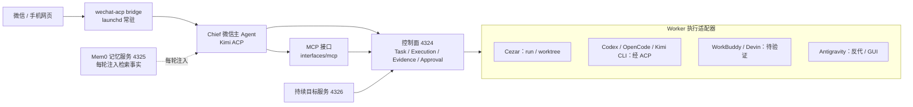
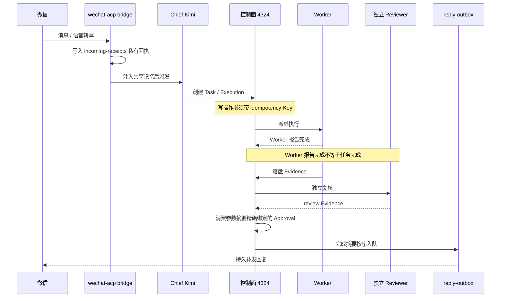
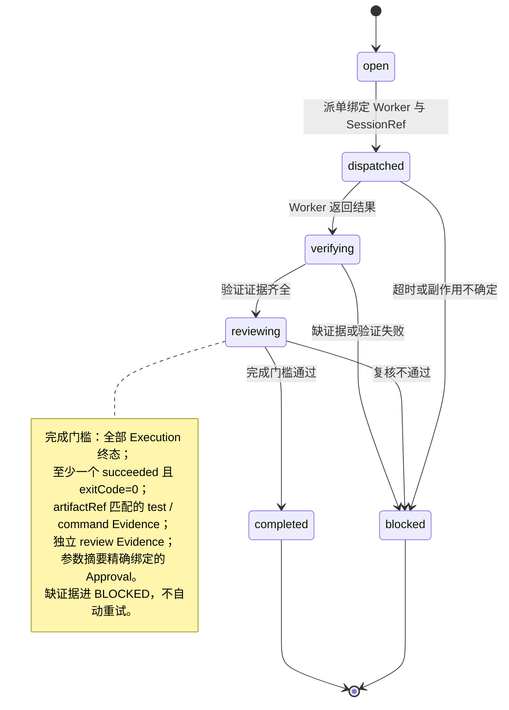

<div align="center">

<picture>
  <source media="(prefers-color-scheme: dark)" srcset="docs/img/logo-dark.svg">
  
</picture>

# Personal AI OS

macOS 本机 AI 调度控制面：可审计的执行与证据闭环。


**[架构设计 v1.2](personal_ai_os_wechat_mac_agent_architecture_v1.html)** · **[执行记录](EXECUTION.md)** · **[0.3.0 计划](docs/plans/0.3.0-execution.md)** · **[上游与致谢](#上游与致谢)**

</div>

## 简介

Personal AI OS 是运行在 macOS 本机上的 AI 调度控制面。微信是移动入口，Cezar（4321）是本地 cockpit，控制面（4324）管理 Task、SessionRef、Execution、Evidence、Approval 和 AgentCapability 契约；Worker 可插拔，涵盖 Cezar、Codex、OpenCode、Kimi CLI、WorkBuddy、Devin、Claude Code 与 Antigravity。它先建立可审计的 Task、SessionRef、Execution 和 Evidence 边界，再逐步增加 Chief 调度、审批和验证闭环。Git 仓库已命名为 personal-ai-os；本地目录与 launchd 标签将在 0.3.0 发布切换时统一迁移（见 [命名统一决策](docs/decisions/rename-personal-ai-os.md)）。

它不是把所有 App 历史复制到一个新数据库，也不是给每个 GUI App 强行套一个"已支持"的标签。索引快照声明 `readOnly=true`、`secretsRead=false`、`messageBodiesRead=false`；控制面只写自己的状态文件，不写外部 Agent 历史。任何 Agent 的恢复能力只记录原生命令提示和验证限制，不会因为"发现了可执行文件"就声称旧会话可以安全恢复。

## 为什么是 Personal AI OS

你大概率同时用着多个 AI Agent：Codex、Claude Code、Kimi、OpenCode、Devin……每个 Agent 有自己的会话格式、配置和记忆，彼此互不往来，于是一些麻烦反复出现：

- **配置割据** —— 模型、key、provider 列表分散在各 Agent 的配置里，换一家供应商就改一遍；
- **记忆不共享** —— 在这个 Agent 里讲清的个人背景，换个 Agent 要从头再说；
- **历史锁死** —— 旧会话困在各自的私有格式里，能不能恢复、如何恢复，没有可验证的答案；
- **完成不可信** —— Agent 说"做完了"没有证据，测试、复核、审计一概缺失；
- **入口缺失** —— 人离开电脑，本机 Agent 一律够不着；
- **断线靠人盯** —— 长任务超时或重启，要么从头再来，要么靠人守着重试。

单看都是小麻烦，合起来的代价是：你得守在工位上，亲自当调度员、记忆库和验收员。

Personal AI OS 要把这三个角色接过去。一个人加上这套系统，相当于一支专业而高效的团队——任务有台账、背景有记忆、交付有复核。任务在跑的时候，你可以在咖啡店、在山顶、在任何有手机信号的地方推进它、记下灵感，而不是把自己钉在办公室里。

它的回答是：不迁移、不复制任何 App 的历史，而是立一个可审计的控制面，把派单、记忆、验证和入口统一管起来。断线有巡检补发，"做完"要过证据关，批准精确绑定——你离开的是工位，不是控制。

## 能力一览

上面的每一条，都对应专业团队里的一个角色：台账是项目经理，记忆是团队知识库，门槛是测试与复核，入口是随时在线的协作频道。你一个人，带着这支团队。

<table>
<tr>
<td width="33%" valign="top">

**📋 一份 Task 账本** — 派单、状态、证据、审批全部落盘可审计。

</td>
<td width="33%" valign="top">

**🧠 一份共享记忆** — 微信与 Chief 共用 Mem0 检索事实，换 fallback 不换命名空间。

</td>
<td width="33%" valign="top">

**🔍 一次诚实的发现** — 只读索引各 Agent 会话元数据；恢复只给未验证计划。

</td>
</tr>
<tr>
<td valign="top">

**✅ 一道完成门槛** — 测试证据、独立复核、精确审批缺一不可。

</td>
<td valign="top">

**📱 一个微信入口** — 手机派任务、查进度、批审批；断线自动巡检补发。

</td>
<td valign="top">

**🧩 一组可插拔 Worker** — Cezar、Codex、OpenCode、Kimi CLI 经统一适配器接入。

</td>
</tr>
</table>

## 方法论来源

调度与验证设计吸收了 Lauren Tan（SpaceXAI）公开的 pstack 思路：skill-first routing、Chief + specialized workers、并行候选与顺序降级、verification-first、独立 review 与长期记忆。本项目的实现是面向个人单机的二次工程推演，不冒充来源作者的原始产品；逐项对照与参考链接见[架构设计 v1.2](personal_ai_os_wechat_mac_agent_architecture_v1.html) 第 19 节。这套思路的个人版推演，正是本项目的愿景——让一个人拥有专业团队的执行与复核能力。

## 上游与致谢

- [Cezar](https://github.com/open-mercato/cezar)（MIT）：本地 cockpit 与派单执行器，以 `vendor/cezar` 内嵌，控制面经 `adapters/engines/cezar.mjs` 接入；
- wechat-acp 桥：微信 ↔ ACP 入口、共享记忆与可靠补发，以 `vendor/wechat-acp` 内嵌；
- 方法论来源见上一节，逐项对照见[架构设计 v1.2](personal_ai_os_wechat_mac_agent_architecture_v1.html) 第 19 节。

## 系统架构



控制面默认只监听 `127.0.0.1`。所有写操作要求幂等键；Cezar 派单还要求动作、目标、参数摘要完全匹配的审批。MCP 工具层默认只创建控制面对象，不直接启动外部 Agent。

## 消息处理时序



回执先落盘再推进轮询游标；回复按用户顺序投递，重启不会清掉待发文本。文本补发复用同一 clientId，但不保证微信服务器 exactly-once；发送接口接受也不等于用户已读。

## Task 生命周期与完成门槛



Task 完成门槛（全部满足才允许 `completed`）：

- 全部 Execution 进入终态；
- 至少一个 Execution `succeeded` 且 `exitCode=0`；
- 存在与同一 artifact 匹配的 test / command Evidence；
- 存在独立的 review Evidence（Reviewer Execution 保留 parent 关联，只创建可审计 review child，不伪装成 Worker 原上下文）；
- 消费一条 action、target、parametersDigest 精确绑定且未消费的 Approval。

缺证据或副作用不确定时进入 `BLOCKED` 并向用户说明，不自动重试、不伪造完成。

## 快速开始

```bash
cd /Users/markus/ai-agent-cockpit

# 启动尚未运行的本地入口（Cezar、微信控制、控制面、持续目标）
./scripts/start-local.sh

# 查看本机 Agent 会话元数据（只读）
npm run sessions
npm run sessions -- --json --provider=codex --limit=20
# 显式调用 Codex ACP session/list（只读，不 load、不 prompt）
npm run sessions -- sessions native-list --provider=codex --cwd="$PWD" --json

# 运行控制面契约与隐私边界测试
npm run test:control-plane

# 运行协议级回归评估（临时状态目录，不调用模型）
npm run eval:control-plane

# 一次性诊断 Cezar、微信、控制面、Mem0、Feature Map 和回归评估
npm run doctor

# 控制面健康检查
curl -fsS http://127.0.0.1:4324/health
```

## 运行入口

| 端口 | 组件 | launchd 标签 | 职责 |
| --- | --- | --- | --- |
| 4321 | Cezar cockpit | `com.markus.ai-agent-cockpit.cezar` | 本地任务、工作树与运行界面 |
| 4322 | 微信控制服务 | `com.markus.ai-agent-cockpit.wechat-control` | 二维码、登录状态与 bridge 启动控制 |
| 4323 | Kimi shim | `com.markus.ai-agent-cockpit.kimi-shim` | 本机 provider 反代 |
| 4324 | Personal AI OS 控制面 | `com.markus.ai-agent-cockpit.control-plane` | Task / Execution / Evidence / Approval |
| 4325 | Mem0 OSS 记忆服务 | `com.markus.personal-ai-os.memory` | 本地向量检索、持久入库队列 |
| 4326 | 持续目标服务 | `com.markus.personal-ai-os.goals` | 范围授权、租约、检查点、预算、自动返工 |
| — | 微信 ACP bridge | `com.markus.ai-agent-cockpit.wechat-bridge` | 微信 → Chief，失败/超时按配置顺序 fallback |
| — | Antigravity 反代 | `com.markus.antigravity-proxy` | Provider 反代 |
| — | keepawake | `com.markus.ai-agent-cockpit.keepawake` | 保持唤醒 |

以上服务均由 launchd 定义常驻，全部只监听回环地址；关闭浏览器不影响后台运行。

## 可移植性与验证状态

控制面与适配器分层设计，平台相关面集中在少数边界：进程托管（launchd）、沙箱（Seatbelt）、本地判断二进制（jev-eval）。当前仅在 macOS 开发、测试与验证；其余平台未开始，不做支持承诺。

| 组件 | 技术栈 | 状态 |
| --- | --- | --- |
| 控制面 / 网关（4324 / 4326 / 4323） | Node.js 24 | macOS 已验证；跨平台天然，未验证 |
| wechat-acp 桥（微信 I/O） | Node.js + iLink 云 API | macOS 已验证；协议层与 OS 无关，未验证 |
| 微信控制服务（4322） | Node.js + iLink 云 API | macOS 已验证；协议层与 OS 无关，未验证 |
| Mem0 记忆服务（4325） | Python + Qdrant | macOS 已验证；跨平台天然，未验证 |
| 进程托管 | launchd | macOS 已验证；其他系统需 systemd 等替代实现 |
| 目标沙箱 | Seatbelt | macOS 已验证；其他系统需 bubblewrap / landlock 等替代 |
| 本地判断二进制 | jev-eval | 仅 macOS 构建 |

微信入口的协议交互与 macOS 基本无关：收发都走腾讯 iLink 云端 Bot API（纯 HTTPS，代码内无 AppleScript、无辅助功能、无本地客户端依赖），macOS 依赖仅存在于部署层（launchd 托管、caffeinate 保活）。下一个候选平台是 Linux（systemd 替换最直接），Windows 可能经 WSL2，均无时间表。

## 目录结构

```text
control-plane/       Task / Execution / Evidence / Approval 契约、存储、路由、派单、原生 ACP 执行器
runtime/             RuntimePort、owner/契约 SQLite、Pi 适配器
gateway/             控制面 HTTP、持续目标服务、微信控制、Kimi shim
interfaces/mcp/      Chief 可用的 MCP 工具层
adapters/engines/    Worker 适配器（cezar.mjs）
services/memory/     Mem0 OSS FastAPI 适配层（service.py / quality.py / lifecycle.py）
vendor/cezar         Cezar cockpit 与 run/worktree 运行时
vendor/wechat-acp    微信 ACP 桥与收件/补发/归档
launchd/             常驻 XML 定义（cezar / bridge / control-plane / memory / goals ...）
config/              本机配置（wechat-acp.json、opencode fallback、runtime-versions）
scripts/             启动、诊断、迁移与 live 验证脚本
tests/               控制面、目标、记忆、权限与运行时测试
evals/               不调用模型的协议级回归评估
docs/                releases 版本说明、plans 计划、decisions、research
```

## 核心子系统

### 微信入口与可靠投递

桥接器先把完整服务器转写和消息元数据写入实例私有 `incoming-receipts/`，再推进轮询游标。前一轮超时后尚未开始的消息保留并继续；`recovery.enabled` 每 5 秒巡检，确认未派发的失败请求按 15/30 秒退避，最多 3 次失败后等待核对。文本补发存入私有 `reply-outbox/`，复用同一 clientId、按用户顺序投递，默认最多 96 次外层尝试，15 秒指数退避至 15 分钟。微信命令包括 `/approve`、`/reject`（含 `/批准`、`/拒绝`）与 `/消息`、`/acp-more`、`/取消`、`/新会话`；命令只改变状态，不绕过控制面执行门槛。**边界**：依赖微信返回的语音转写，无原始音频 ASR；前台仍有 5 分钟处理上限；二进制附件补发不解决；`reply_pending` 表示文本待补发，普通 `done` 表示轮次结束，都不是用户已读。详见 [0.2.2 说明](docs/releases/0.2.2.md)。

### 共享记忆（Mem0 OSS）

每轮实际派发前统一注入人格规则、近期对话、较早的有损摘录和Mem0相关事实，切换fallback不更换记忆命名空间；完整正文追加到私有`conversation-archive/*.jsonl`。存储/embedding本地运行（Qdrant + SQLite + 384维多语言模型），位于`~/.local/state/personal-ai-os/mem0/`。历史基线使用Kimi生成式提炼且出现事实缺失；升级源码改用本机`jev-eval` wrapper调用**远程Jev**选择和验证完整原文句子，Mem0以infer=False存储，不生成式改写，也不是全离线。来源/软忘记已有隔离证据，更正/擦除/原生上下文重置与正式部署仍未验收，见[阶段台账](docs/plans/0.3.0-status.md)。交付语义是at-least-once，不保证断电exactly-once；永久拒绝记录留在私有`rejectedOutbox`。运维见[记忆服务文档](services/memory/README.md)。

### 持续目标（goals 4326）

在仪表盘"持续目标 · 自主验证"创建草稿，查看文件范围、不可修改的验收和 token 上限，再确认启动；Kimi 规划/复核，官方 DeepSeek V4.1 Flash 提出修改，修改只应用到私有副本，真实 `node --test` 验收在 macOS Seatbelt 下运行。失败自行返工，默认最多 3 次自恢复，不逐轮请求人工批准。微信 `/目标` 抽查进度，支持查看、暂停、恢复、取消与暂停全部。**边界**：确认范围需完整 scope digest，聊天模型不能代批；只支持已有文本文件与固定 Node 验收；输入会发送给既有 provider，不是全离线。详见 [0.2.0 说明](docs/releases/0.2.0.md)。

## Agent 接入现状

通讯平台是“用户入口”，下表的CLI/App是“执行Worker”，两者不共用“已连接”含义。最新阶段状态见[四类状态台账](docs/plans/0.3.0-status.md)。

| Agent | 会话元数据 | 原生恢复提示 | 目前限制 |
| --- | --- | --- | --- |
| Codex | SQLite + 显式ACP `session/list`只读索引 | load/resume能力已探测；历史一次选定session/load probe成功 | 不等于真实prompt/多Worker闭环；用户旧会话仍须精确范围 |
| Codex App | Feature Map独立来源，当前unknown | 与Codex CLI分开核对 | App占用、准确旧会话与GUI恢复未单独验收 |
| OpenCode | SQLite + ACP `session/list` 只读索引 | ACP load/resume capability 已实测 | 未执行 load、prompt 或消息读取 |
| Kimi CLI | `session_index.jsonl` + ACP `session/list` | ACP load/resume capability 已实测 | 新建隔离 ACP 会话的真实 prompt/记忆召回已通过；用户旧会话恢复仍未验收 |
| WorkBuddy | 已发现 App/`codebuddy --acp`，ACP initialize 成功 | 声明 loadSession/MCP，但未声明 session/list | 旧会话不能由控制面猜测或静默创建 |
| Devin | App/ACP `session/list` 已实测 | 声明 loadSession，未声明 resume | 真实 prompt、认证、load 和云端能力仍待验证 |
| Claude Code | 已发现本地入口 | 原生 session 机制 | 本版本不读取 `~/.claude` 历史 |
| Antigravity | 已发现 App/本机反代 | GUI-only / proxy | 没有稳定的本地旧会话索引 |
| DeepSeek Harness App | Feature Map独立来源，当前unknown | 尚无已验收的原生恢复通道 | 模型provider成功不能当作Harness App或旧对话已接通 |

## 社交与工作平台兼容性

当前只用微信接入、开发和验证。其他平台可以复用微信的持久收件/补发、身份、记忆、运行与验收规则，但需要各自的认证和消息适配；“平台有SDK”不等于本项目已支持。

| 平台 | 当前项目状态 | 接入方向 / 边界 |
| --- | --- | --- |
| 微信（现有wechat-acp通道） | 已接入0.2.2，本轮connected | 二维码绑定、文字与服务器语音转写；新Pi后台联动待做 |
| 飞书 / Lark | 未接入，优先候选 | 官方SDK长连接bot；应用/租户授权与审批回调需单独验证 |
| WhatsApp | 未接入，候选 | 优先官方Business Cloud API/webhook；不默认接管个人客户端 |
| Telegram | 未接入，候选 | 官方Bot API长轮询或webhook；身份/游标/媒体逐项验 |
| Slack | 未接入，候选 | 官方bot/Socket Mode；不是只有单向通知webhook |
| Discord / 钉钉 / 企业微信 / Teams / LINE | 未接入，待专项调研 | 官方bot/应用候选；权限、收件与投递规则各自核对 |
| Signal / iMessage / QQ等个人客户端 | 未接入，暂不承诺默认支持 | 先确认可靠接口与账号边界，不把GUI外挂当稳定兼容 |
| 手机网页 | 未接入，研究在途 | Paseo 调查（[docs/research/](docs/research/paseo-2026-10-07.md)），候选跨平台入口 |

完整列表、官方依据、薄ChannelPort模板草案和验收要求见[通讯平台兼容与接入模板](docs/plans/channel-compatibility.md)。模板尚未编码，其他平台本轮未安装/登录/测试；后续扩展不为每个平台复制一套Chief或调度器，也不自动扩大0.3.0发布范围。桥的通用管线（收件、补发、记忆注入）可直接复用，但尚未抽象出平台无关的 transport 接口（当前与微信消息类型耦合）；第二个连接器尚未落地，模板化成本未实测。

## 安全与隐私边界

- **回环与幂等**：所有 HTTP 服务只监听 `127.0.0.1`；所有写操作要求幂等键，派单要求参数摘要精确绑定的审批。
- **架构原则**：
  1. Session 由原生 Agent 管理，Task、Execution 和审计事件由控制面管理；标题不能作为会话身份，恢复必须绑定来源、profile、原生 ID 和工作目录。
  2. Worker 报告完成后必须经过验证和 review，不能直接把任务标成最终完成。
  3. fallback 只在尚未产生可确认副作用的启动失败、超时或协议错误边界内执行；已有副作用的执行不会被静默重试。
  4. 工作目录不是沙箱；控制面不会通过 bypass、自动批准或复制凭据来"修复"接入失败。
  5. 本机 Devin 与 Devin Cloud 是两个不同适配器；本机 ACP 握手成功不代表云端、认证、计费或旧会话恢复已经打通。
- **隐私**：私有状态目录为 0700、token/状态文件为 0600；控制面只写自己的状态文件，不写外部 Agent 历史，不读取认证文件或消息正文；token、API key、二维码登录状态不进 Git；状态位于 `~/.local/state/`，控制面自身状态为 `~/.local/state/ai-agent-cockpit/control-plane.json`。

## 测试与验证

| 命令 | 覆盖范围 |
| --- | --- |
| `npm run test:control-plane` | 控制面契约与 HTTP 边界 |
| `npm run eval:control-plane` | 协议回归，临时状态目录，不调用模型 |
| `npm run test:goals` | 目标范围、租约、预算、验收、返工与 Seatbelt 隔离 |
| `npm run test:runtime-tools` | 任务绑定的Pi查询/queued子执行/规划与权限拒绝；合成HTTP/SSE |
| `npm run test:runtime-recovery` | 真实SIGKILL测试进程与SDK safe/unsafe四组合；无原生派单 |
| `npm run test:kimi-shim` | loopback流式首帧、错误脱敏与HTTP边界；无真实认证 |
| `npm run runtime:tools-canary` | 默认faux，只读查询/保存答案/重开，零网络 |
| `npm run test:runtime-tools-live` | 临时loopback shim与真实Kimi只读查询，最多2轮；不重启生产 |
| `npm run test:memory-service` | 记忆服务鉴权、隔离、幂等、重试与权限 |
| `npm run test:voice-live` | 真实模型/真实服务，产生少量费用 |
| `npm run test:memory-live` | 真实 Mem0 + Kimi 中文提炼与检索，产生少量模型调用 |
| `npm run test:memory-kimi` | 真实 Kimi ACP 使用注入记忆，不发送真实微信消息 |
| `npm run test:memory-quality-live` | 真实 Jev + Mem0 隔离质量检查，产生少量调用 |
| `npm run test:memory-recovery` | macOS 实际停启 Mem0，验证降级与回放 |
| `npm run test:goals-live` | 真实 Kimi/DeepSeek 合成修复试运行，产生少量模型费用 |
| `npm run test:goal-recovery-live` | 真实提案后中断、检查点接续、真实验收与独立复核 |

带 `-live` 的脚本会调用真实模型或真实服务，产生少量费用，建议在相应阶段的合成命名空间与预算内运行。

2026-10-08追加隔离证据：运行层87项、权限27项、控制面21项、Goal60项、Kimi shim9项通过。真实Kimi只读工具查询已保存结果，重复/重开额外调用为零。受控工具仍只查询、创建queued子执行与规划，不派单、不审批、不写文件；生产仍为0.2.2/legacy，微信/后台/迁移尚未接管。详见[当前实施证据](docs/decisions/runtime-0.3.0.md)。

## 文档导航

| 文档 | 内容 |
| --- | --- |
| [0.2.0](docs/releases/0.2.0.md) · [0.2.1](docs/releases/0.2.1.md) · [0.2.2](docs/releases/0.2.2.md) | 三个版本的机制、验证与边界 |
| [0.3.0 升级方案](docs/plans/0.3.0-upgrade.md) · [执行计划](docs/plans/0.3.0-execution.md) · [验收矩阵](docs/plans/0.3.0-validation.md) · [裁剪清单](docs/plans/0.3.0-pruning.md) · [可视化概览](docs/plans/0.3.0-overview.html) | 0.3.0 边界、实施与退出条件 |
| [运行时决策](docs/decisions/runtime-0.3.0.md) | P0/P1/P2 证据与决定 |
| [阶段台账](docs/plans/0.3.0-status.md) · [四类状态可视化](docs/plans/0.3.0-overview.html) | 已完成、正在推进、待办、待测试验证；名称/现场与证据日期 |
| [通讯平台兼容表](docs/plans/channel-compatibility.md) | 微信已接入、其他平台候选；复用模板与平台差异 |
| [Paseo 源码调查](docs/research/paseo-2026-10-07.md) · [可视化](docs/research/paseo-2026-10-07.html) | 手机端、外部 CLI、权限边界；尚未部署 |
| [执行文档](EXECUTION.md) | 每个阶段的实际状态、验证命令、证据边界与未完成项 |
| [架构设计 v1.2](personal_ai_os_wechat_mac_agent_architecture_v1.html) | 产品边界、Task/Session/Execution 模型与路线图 |
| [微信配置说明](config/README.md) · [Gateway 说明](gateway/README.md) · [记忆服务文档](services/memory/README.md) | 兼容期入口与本机凭据边界 |

## 路线图

当前生产为0.2.2 / legacy；0.3.0的P0–P2正在推进，已有记忆质量/软忘记、基本运行适配、受控查询/排队/规划、权限/Goal broker、SDK重放及Kimi只读工具证据，但后台所有权、正式provider/fallback、legacy与微信/Outbox接线仍未完成。P3–P7和强制P6c待实施，完整G0–G6未通过。源码与隔离证据不等于上线，204项自动化不等于52项发布场景全部通过。

当前工作按[阶段台账](docs/plans/0.3.0-status.md)的已完成D、正在推进I、待办B、待验证T维护；依赖、门槛和失败退出见[执行计划](docs/plans/0.3.0-execution.md)。GitHub仓库已改名并公开为personal-ai-os；本地路径/标签/状态/微信实例的命名批次2仍待已验证切换窗口，详见[命名决策](docs/decisions/rename-personal-ai-os.md)。

## 许可证

GitHub仓库目前公开；自有代码尚未选择项目级开源许可证。公开状态与许可证选择分开，后者列入发布待办；vendor和第三方组件保留各自许可证与版权说明，本轮未新增或变更许可证。
