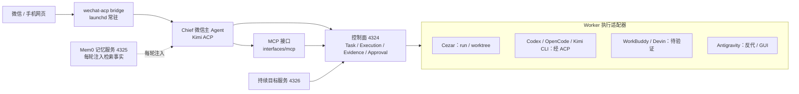
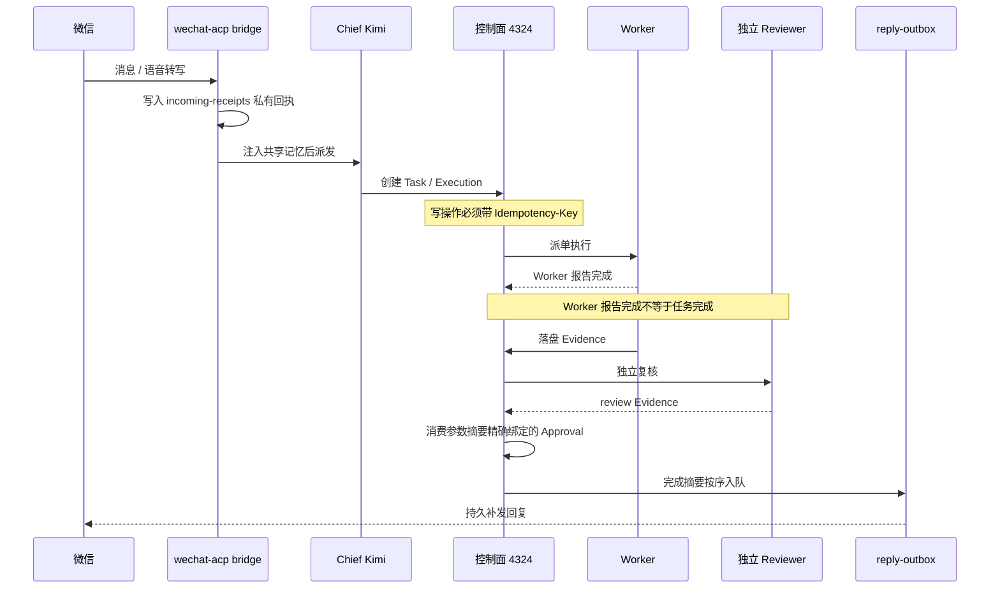
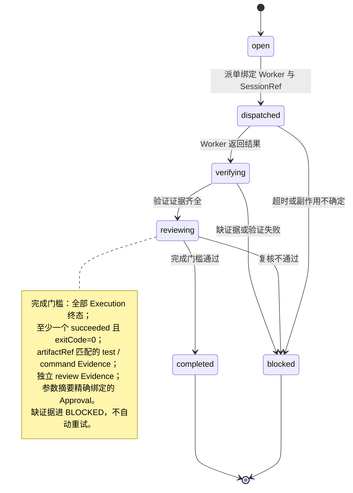

# Personal AI OS


macOS 本机 AI 调度控制面：可审计的执行与证据闭环。

## 简介

Personal AI OS 是运行在 macOS 本机上的 AI 调度控制面。微信是移动入口，Cezar（4321）是本地 cockpit，控制面（4324）管理 Task、SessionRef、Execution、Evidence、Approval 和 AgentCapability 契约；Worker 可插拔，涵盖 Cezar、Codex、OpenCode、Kimi CLI、WorkBuddy、Devin、Claude Code 与 Antigravity。它先建立可审计的 Task、SessionRef、Execution 和 Evidence 边界，再逐步增加 Chief 调度、审批和验证闭环。项目当前仍使用 `ai-agent-cockpit` 目录与既有 launchd 标签，以保证旧服务、微信身份和原生会话不被迁移或破坏。

它不是把所有 App 历史复制到一个新数据库，也不是给每个 GUI App 强行套一个"已支持"的标签。索引快照声明 `readOnly=true`、`secretsRead=false`、`messageBodiesRead=false`；控制面只写自己的状态文件，不写外部 Agent 历史。任何 Agent 的恢复能力只记录原生命令提示和验证限制，不会因为"发现了可执行文件"就声称旧会话可以安全恢复。

## 系统架构



控制面默认只监听 `127.0.0.1`。所有写操作要求幂等键；Cezar 派单还要求动作、目标、参数摘要完全匹配的审批。MCP 工具层默认只创建控制面对象，不直接启动外部 Agent。

## 消息处理时序



回执先落盘再推进轮询游标；回复按用户顺序投递，重启不会清掉待发文本。文本补发复用同一 clientId，但不保证微信服务器 exactly-once；发送接口接受也不等于用户已读。

## Task 生命周期与完成门槛



Task 完成门槛（全部满足才允许 `completed`）：

- 全部 Execution 进入终态；
- 至少一个 Execution `succeeded` 且 `exitCode=0`；
- 存在与同一 artifact 匹配的 test / command Evidence；
- 存在独立的 review Evidence（Reviewer Execution 保留 parent 关联，只创建可审计 review child，不伪装成 Worker 原上下文）；
- 消费一条 action、target、parametersDigest 精确绑定且未消费的 Approval。

缺证据或副作用不确定时进入 `BLOCKED` 并向用户说明，不自动重试、不伪造完成。

## 快速开始

```bash
cd /Users/markus/ai-agent-cockpit

# 启动尚未运行的本地入口（Cezar、微信控制、控制面、持续目标）
./scripts/start-local.sh

# 查看本机 Agent 会话元数据（只读）
npm run sessions
npm run sessions -- --json --provider=codex --limit=20
# 显式调用 Codex ACP session/list（只读，不 load、不 prompt）
npm run sessions -- sessions native-list --provider=codex --cwd="$PWD" --json

# 运行控制面契约与隐私边界测试
npm run test:control-plane

# 运行协议级回归评估（临时状态目录，不调用模型）
npm run eval:control-plane

# 一次性诊断 Cezar、微信、控制面、Mem0、Feature Map 和回归评估
npm run doctor

# 控制面健康检查
curl -fsS http://127.0.0.1:4324/health
```

## 运行入口

| 端口 | 组件 | launchd 标签 | 职责 |
| --- | --- | --- | --- |
| 4321 | Cezar cockpit | `com.markus.ai-agent-cockpit.cezar` | 本地任务、工作树与运行界面 |
| 4322 | 微信控制服务 | `com.markus.ai-agent-cockpit.wechat-control` | 二维码、登录状态与 bridge 启动控制 |
| 4323 | Kimi shim | `com.markus.ai-agent-cockpit.kimi-shim` | 本机 provider 反代 |
| 4324 | Personal AI OS 控制面 | `com.markus.ai-agent-cockpit.control-plane` | Task / Execution / Evidence / Approval |
| 4325 | Mem0 OSS 记忆服务 | `com.markus.personal-ai-os.memory` | 本地向量检索、持久入库队列 |
| 4326 | 持续目标服务 | `com.markus.personal-ai-os.goals` | 范围授权、租约、检查点、预算、自动返工 |
| — | 微信 ACP bridge | `com.markus.ai-agent-cockpit.wechat-bridge` | 微信 → Chief，失败/超时按配置顺序 fallback |
| — | Antigravity 反代 | `com.markus.antigravity-proxy` | Provider 反代 |
| — | keepawake | `com.markus.ai-agent-cockpit.keepawake` | 保持唤醒 |

以上服务均由 launchd 定义常驻，全部只监听回环地址；关闭浏览器不影响后台运行。

## 目录结构

```text
control-plane/       Task / Execution / Evidence / Approval 契约、存储、路由、派单、原生 ACP 执行器
runtime/             RuntimePort、owner/契约 SQLite、Pi 适配器
gateway/             控制面 HTTP、持续目标服务、微信控制、Kimi shim
interfaces/mcp/      Chief 可用的 MCP 工具层
adapters/engines/    Worker 适配器（cezar.mjs）
services/memory/     Mem0 OSS FastAPI 适配层（service.py / quality.py / lifecycle.py）
vendor/cezar         Cezar cockpit 与 run/worktree 运行时
vendor/wechat-acp    微信 ACP 桥与收件/补发/归档
launchd/             常驻 XML 定义（cezar / bridge / control-plane / memory / goals ...）
config/              本机配置（wechat-acp.json、opencode fallback、runtime-versions）
scripts/             启动、诊断、迁移与 live 验证脚本
tests/               控制面、目标、记忆、权限与运行时测试
evals/               不调用模型的协议级回归评估
docs/                releases 版本说明、plans 计划、decisions、research
```

## 核心子系统

### 微信入口与可靠投递

桥接器先把完整服务器转写和消息元数据写入实例私有 `incoming-receipts/`，再推进轮询游标。前一轮超时后尚未开始的消息保留并继续；`recovery.enabled` 每 5 秒巡检，确认未派发的失败请求按 15/30 秒退避，最多 3 次失败后等待核对。文本补发存入私有 `reply-outbox/`，复用同一 clientId、按用户顺序投递，默认最多 96 次外层尝试，15 秒指数退避至 15 分钟。微信命令包括 `/approve`、`/reject`（含 `/批准`、`/拒绝`）与 `/消息`、`/acp-more`、`/取消`、`/新会话`；命令只改变状态，不绕过控制面执行门槛。**边界**：依赖微信返回的语音转写，无原始音频 ASR；前台仍有 5 分钟处理上限；二进制附件补发不解决；`reply_pending` 表示文本待补发，普通 `done` 表示轮次结束，都不是用户已读。详见 [0.2.2 说明](docs/releases/0.2.2.md)。

### 共享记忆（Mem0 OSS）

每轮实际派发前统一注入人格规则、近期对话、较早的有损摘录和 Mem0 检索到的相关事实，切换 fallback 不更换记忆命名空间。完整对话正文追加到私有 `conversation-archive/*.jsonl`。存储与 embedding 本地运行（Qdrant + SQLite + 384 维多语言模型），目录位于 `~/.local/state/personal-ai-os/mem0/`；**事实提炼走现有 Kimi API，不是全离线**。质量闸门先屏蔽常见 token 格式，再把原文句子交给本地 `jev-eval` 判断资格与完整性，不生成式改写。交付语义是 at-least-once，不保证断电窗口 exactly-once；永久拒绝的记录保留在私有 `rejectedOutbox`。安装与运维见 [记忆服务文档](services/memory/README.md)。

### 持续目标（goals 4326）

在仪表盘"持续目标 · 自主验证"创建草稿，查看文件范围、不可修改的验收和 token 上限，再确认启动；Kimi 规划/复核，官方 DeepSeek V4.1 Flash 提出修改，修改只应用到私有副本，真实 `node --test` 验收在 macOS Seatbelt 下运行。失败自行返工，默认最多 3 次自恢复，不逐轮请求人工批准。微信 `/目标` 抽查进度，支持查看、暂停、恢复、取消与暂停全部。**边界**：确认范围需完整 scope digest，聊天模型不能代批；只支持已有文本文件与固定 Node 验收；输入会发送给既有 provider，不是全离线。详见 [0.2.0 说明](docs/releases/0.2.0.md)。

## Agent 接入现状

| Agent | 会话元数据 | 原生恢复提示 | 目前限制 |
| --- | --- | --- | --- |
| Codex | SQLite + 显式 ACP `session/list` 只读索引 | ACP `session/load` / `session/resume` 已被 capability probe 证实存在 | 未执行恢复、prompt 或工具调用 |
| OpenCode | SQLite + ACP `session/list` 只读索引 | ACP load/resume capability 已实测 | 未执行 load、prompt 或消息读取 |
| Kimi CLI | `session_index.jsonl` + ACP `session/list` | ACP load/resume capability 已实测 | 新建隔离 ACP 会话的真实 prompt/记忆召回已通过；用户旧会话恢复仍未验收 |
| WorkBuddy | 已发现 App/`codebuddy --acp`，ACP initialize 成功 | 声明 loadSession/MCP，但未声明 session/list | 旧会话不能由控制面猜测或静默创建 |
| Devin | App/ACP `session/list` 已实测 | 声明 loadSession，未声明 resume | 真实 prompt、认证、load 和云端能力仍待验证 |
| Claude Code | 已发现本地入口 | 原生 session 机制 | 本版本不读取 `~/.claude` 历史 |
| Antigravity | 已发现 App/本机反代 | GUI-only / proxy | 没有稳定的本地旧会话索引 |

## 安全与隐私边界

- **回环与幂等**：所有 HTTP 服务只监听 `127.0.0.1`；所有写操作要求幂等键，派单要求参数摘要精确绑定的审批。
- **架构原则**：
  1. Session 由原生 Agent 管理，Task、Execution 和审计事件由控制面管理；标题不能作为会话身份，恢复必须绑定来源、profile、原生 ID 和工作目录。
  2. Worker 报告完成后必须经过验证和 review，不能直接把任务标成最终完成。
  3. fallback 只在尚未产生可确认副作用的启动失败、超时或协议错误边界内执行；已有副作用的执行不会被静默重试。
  4. 工作目录不是沙箱；控制面不会通过 bypass、自动批准或复制凭据来"修复"接入失败。
  5. 本机 Devin 与 Devin Cloud 是两个不同适配器；本机 ACP 握手成功不代表云端、认证、计费或旧会话恢复已经打通。
- **隐私**：私有状态目录为 0700、token/状态文件为 0600；控制面只写自己的状态文件，不写外部 Agent 历史，不读取认证文件或消息正文；token、API key、二维码登录状态不进 Git；状态位于 `~/.local/state/`，控制面自身状态为 `~/.local/state/ai-agent-cockpit/control-plane.json`。

## 测试与验证

| 命令 | 覆盖范围 |
| --- | --- |
| `npm run test:control-plane` | 控制面契约与 HTTP 边界 |
| `npm run eval:control-plane` | 协议回归，临时状态目录，不调用模型 |
| `npm run test:goals` | 目标范围、租约、预算、验收、返工与 Seatbelt 隔离 |
| `npm run test:memory-service` | 记忆服务鉴权、隔离、幂等、重试与权限 |
| `npm run test:voice-live` | 真实模型/真实服务，产生少量费用 |
| `npm run test:memory-live` | 真实 Mem0 + Kimi 中文提炼与检索，产生少量模型调用 |
| `npm run test:memory-kimi` | 真实 Kimi ACP 使用注入记忆，不发送真实微信消息 |
| `npm run test:memory-quality-live` | 真实 Jev + Mem0 隔离质量检查，产生少量调用 |
| `npm run test:memory-recovery` | macOS 实际停启 Mem0，验证降级与回放 |
| `npm run test:goals-live` | 真实 Kimi/DeepSeek 合成修复试运行，产生少量模型费用 |
| `npm run test:goal-recovery-live` | 真实提案后中断、检查点接续、真实验收与独立复核 |

带 `-live` 的脚本会调用真实模型或真实服务，产生少量费用，建议在相应阶段的合成命名空间与预算内运行。

## 文档导航

| 文档 | 内容 |
| --- | --- |
| [0.2.0](docs/releases/0.2.0.md) · [0.2.1](docs/releases/0.2.1.md) · [0.2.2](docs/releases/0.2.2.md) | 三个版本的机制、验证与边界 |
| [0.3.0 升级方案](docs/plans/0.3.0-upgrade.md) · [执行计划](docs/plans/0.3.0-execution.md) · [验收矩阵](docs/plans/0.3.0-validation.md) · [裁剪清单](docs/plans/0.3.0-pruning.md) · [可视化概览](docs/plans/0.3.0-overview.html) | 0.3.0 边界、实施与退出条件 |
| [运行时决策](docs/decisions/runtime-0.3.0.md) | P0/P1/P2 证据与决定 |
| [Paseo 源码调查](docs/research/paseo-2026-10-07.md) · [可视化](docs/research/paseo-2026-10-07.html) | 手机端、外部 CLI、权限边界；尚未部署 |
| [执行文档](EXECUTION.md) | 每个阶段的实际状态、验证命令、证据边界与未完成项 |
| [架构设计 v1.2](personal_ai_os_wechat_mac_agent_architecture_v1.html) | 产品边界、Task/Session/Execution 模型与路线图 |
| [微信配置说明](config/README.md) · [Gateway 说明](gateway/README.md) · [记忆服务文档](services/memory/README.md) | 兼容期入口与本机凭据边界 |

## 路线图

当前在 0.3.0：P0–P2 隔离实现进行中（已写但**未提交**），G0/G1/G2 发布门槛尚未全部通过，P3–P7 待执行，P6c 强制裁剪尚未达到物理删除标准。运行时基础、权限/身份/锁及无工具 Kimi 探测已通过，但完整 Goal 委派/OS 权限、后台生命周期、记忆生命周期、迁移回退仍待验收；现役运行版本未切换，严格身份与 broker 尚未接管微信。详见 [0.3.0 执行计划](docs/plans/0.3.0-execution.md)。

## 许可证

当前为私有个人项目，未附加开源许可证；在未获许可前保留所有权利。
