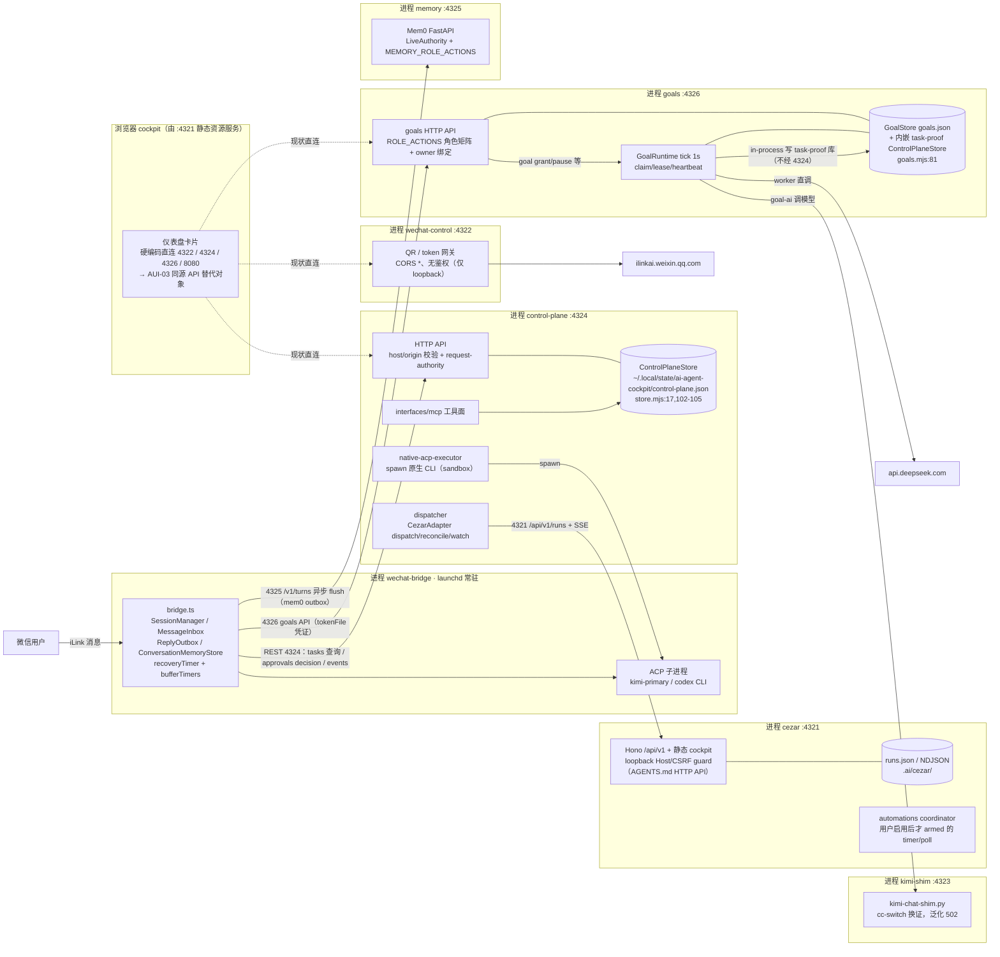

# AUI-01/03/04/05 收敛依赖图与设计交付（C 线）

## 2026-10-09 接力复核修订

主线程依[四线复核](../audits/2026-10-09-parallel-alignment-r1.md)纠正本设计：launchd 文件为启动配置而非运行态证据；F3 参数不一致不等于双 owner 工作；QR/status 是带副作用生命周期，不能混入只读代理；浏览器 principal 与服务 viewer 凭证分离，禁止固定 actor=local 绕 owner。没有做生产探针或同源API施工。以下出处仍基于 C 线冻结工作树，行号仅辅助、符号为准。

日期：2026-10-09（行号以当日晚工作树为准；S03/S04 同事并行合入可能使行号小幅漂移，锚点符号不变）。性质：**只读探查 + 设计文档，不施工**。本文交付 docs/plans/architecture-ui-todo.md 中 AUI-01（真实依赖/owner 图）、AUI-03（最小同源 API 方案）、AUI-04（统一只读投影）、AUI-05（IA/路由去向），并附 AUI-02/06/07 要点映射。依据：architecture-ui-todo.md §1–§6、0.3.0-pruning.md C01–C15、0.3.0-remediation-2026-10-09.md S02/S04/S05、docs/handoffs/s02-deploy-candidate-r1.md、vendor/cezar/AGENTS.md。

所有事实均带源码出处（文件:行号）。"待核实"表示本轮只读探查无法闭环确认，未做任何生产探针。

---

## 1. AUI-01：真实集成清单与 owner 图

### 1.1 集成盘点（四分法）

| 集成 | 类别 | 入口/加载证据 | 生产角色 |
| --- | --- | --- | --- |
| Cezar cockpit（vendor/cezar） | **仓内启动配置（运行态待核验）** | `launchd/com.markus.ai-agent-cockpit.cezar.plist:8-10` → `vendor/cezar/packages/cezar/dist/index.js --port 4321` | 任务 cockpit：Hono `/api/v1` + 静态 Web（runs/workflows/git/automations/agent-config），状态在 `.ai/cezar/`（vendor/cezar/AGENTS.md:3） |
| control-plane gateway | **仓内启动配置（运行态待核验）** | `launchd/com.markus.ai-agent-cockpit.control-plane.plist:9-10` → `gateway/control-plane.mjs`（`gateway/control-plane.mjs:16` 端口 4324） | Task/Execution/Approval/审计权威 HTTP 面 + MCP（`gateway/control-plane.mjs:117-119`） |
| 微信 bridge（vendor/wechat-acp） | **仓内启动配置（运行态待核验）** | `launchd/com.markus.ai-agent-cockpit.wechat-bridge.plist:8-14` → `dist/bin/wechat-acp.js --instance cezar-codex --agent kimi-primary` | 微信↔ACP 会话桥：收件、会话、投递、目标/控制面客户端（`vendor/wechat-acp/src/bridge.ts:5`） |
| wechat-control | **仓内启动配置（运行态待核验）** | `launchd/com.markus.ai-agent-cockpit.wechat-control.plist:7-8` → `gateway/wechat-control.mjs`（`:17` 端口 4322） | 微信 QR/连接状态网关；持 token 于 `~/.wechat-acp/instances/cezar-codex/token.json`（`gateway/wechat-control.mjs:12,68-70`） |
| goals 服务 | **仓内启动配置（运行态待核验）** | `launchd/com.markus.personal-ai-os.goals.plist:5` → `gateway/goals.mjs`（`gateway/goals.mjs:166` 端口 4326） | Goal 规划/调度/验收：`GoalRuntime` tick（`control-plane/goal-runtime.mjs:17`）+ GoalStore |
| memory 服务（Mem0） | **仓内启动配置（运行态待核验）** | `launchd/com.markus.personal-ai-os.memory.plist:5-9` → `services.memory.service:app`（127.0.0.1:4325） | 记忆唯一事实源：`/v1/turns|status|search|forget|controls`（`services/memory/service.py:1038-1067`） |
| kimi-chat-shim | **仓内启动配置（运行态待核验）** | `launchd/com.markus.ai-agent-cockpit.kimi-shim.plist:6-7` → `gateway/kimi-chat-shim.py`（`:12` 端口 4323） | Kimi 凭证换证代理（读 `~/.cc-switch/cc-switch.db`，`gateway/kimi-chat-shim.py:13,25-34`）；Goal 规划器经它调 Kimi（`control-plane/goal-ai.mjs:38`） |
| keepawake | **仓内启动配置（基础设施，运行态待核验）** | `launchd/com.markus.ai-agent-cockpit.keepawake.plist:6` → `caffeinate -i -m` | 防睡眠，无业务面 |
| antigravity-proxy :8080 | **外部依赖（非本仓库）** | `launchd/com.markus.antigravity-proxy.plist:9-10` 指向仓库外 `/Users/markus/agent/antigravity-local-proxy` | 本仓库只做客户端探测（`vendor/cezar/packages/web/src/routes/dashboard/system-connections.tsx:36,60`）；不算接进 |
| Pi runtime（`@earendil-works/pi-durable` 等 5 包） | **安装/过渡候选** | `package.json` dependencies；`runtime/pi-adapter.mjs:232`（PiRuntimeAdapter）经 `runtime/route-binding.mjs:6` 与 legacy-adapter 互斥单 runtime 绑定 | RuntimePort 合同面；**主对话链路（bridge ACP 子进程）不走它**，现役由 canary 与 legacy-adapter 路径驱动；接线深度待核实 |
| paseo client（`@getpaseo/client`） | **安装候选（用途有限）** | `package.json` dependencies；仅 `scripts/runtime-canary.mjs`、`tests/runtime-canary.test.mjs` 引用 | canary 用途，非产品路径 |
| legacy-adapter | **旧待办兼容** | `runtime/legacy-adapter.mjs:1-30`（term-limited facade，"NO PERMANENT DUAL OWNERSHIP"） | 旧 ACP 子进程模型的有期兼容壳，与 pi-durable 共用 route-binding store |
| S02 部署候选包 | **安装候选（未部署）** | `docs/handoffs/s02-deploy-candidate-r1.md:7-13`：authority 候选 + 四客户端映射，状态 READY_FOR_REVIEW，**未部署、未写现役路径** | 目标/记忆每客户端 principal 的候选配置 |
| Codync / OpenMausBot / Rakazo | **研究参考（不算接进）** | `docs/research/grok-bot-alternatives/README.md:1-5`、`docs/plans/0.4.0-reference-plan.md:1-12` 自述"研究驱动的候选方案，不是已批准实施合同" | 仅源码研究与 0.4.0 候选映射 |

判定说明：追的是实际启动入口（launchd ProgramArguments + 网关 listen + bridge 常驻进程），不是 package.json 包数。vendor/cezar 与 vendor/wechat-acp 是**配置为启动目标的 vendor fork**（cezar 承载主 cockpit 与静态 Web；wechat-acp 是微信入口唯一生产桥），不是参考材料。

### 1.2 进程边界与模块依赖图（mermaid）

跨进程边界即 loopback 端口边界：4321（cezar）、4322（wechat-control）、4323（kimi-shim）、4324（control-plane）、4325（memory）、4326（goals）、8080（仓库外 antigravity-proxy）。

### 1.3 task / conversation / schedule 唯一 owner 表

**Task / Execution**

| 环节 | 唯一 owner | 证据 |
| --- | --- | --- |
| 创建 | **control-plane store**（三条创建路径汇入同一 `ControlPlaneStore.createTask`，`control-plane/store.mjs:310-315`）：① GoalRuntime 迭代（`control-plane/goal-runtime.mjs:86`，in-process 写 goals 进程内 task-proof 库）；② MCP `create_task`（`interfaces/mcp/server.mjs:226`）；③ CLI `scripts/control-plane.mjs:70` | 持久化 `~/.local/state/ai-agent-cockpit/control-plane.json`（主库，`store.mjs:17,104`）；**注意 goals 进程用独立 task-proof 目录（见 §1.5-F4）** |
| 派发 | **dispatcher.mjs**（Cezar：`dispatchCezar`/`reconcileCezarExecution`/`watchCezarExecution`，`control-plane/dispatcher.mjs:120-194`）与 **native-acp-executor.mjs**（原生 CLI）；两者都先过 `assertDispatchGrant` 准入（`dispatcher.mjs:91-105`） | engineRef 回写 `store.attachExecutionRef`（`dispatcher.mjs:149-156`），Cezar SSE watcher 同进程内派发后常驻（`gateway/control-plane.mjs:238`） |
| 审批 | **control-plane store**：Approval 创建（GoalRuntime 完成门 `goal-runtime.mjs:147-149`；MCP `server.mjs:253`；网关 `gateway/control-plane.mjs:154-157`），decision 消费 `consumeApproval`（`dispatcher.mjs:134`）；strict 模式 decision 须 operator（`control-plane/request-authority.mjs:197-199`） | 微信侧 decision 由 bridge 代发（`vendor/wechat-acp/src/bridge.ts:1066-1076`） |
| 验收/完成 | **control-plane store**：`completeTask` 必须带 approvalId（`store.mjs:352`）；GoalRuntime 完成前过 `completionPlan` 证据门（`goal-runtime.mjs:145-150`）；独立 Reviewer 经 `createReviewerExecution`（`gateway/control-plane.mjs:206`） | goal 侧再由 `reconcileCompleted` 凭 task 的 `completionProof.parametersDigest` 收敛 goal（`goal-runtime.mjs:43-51`） |

**conversation（会话）**

| 环节 | 唯一 owner | 证据 |
| --- | --- | --- |
| 微信↔Agent 会话生命周期 | **vendor/wechat-acp SessionManager**（`bridge.ts:246-258`）：每 userId 一会话，串行队列 + retainedMessages（`vendor/wechat-acp/src/acp/session.ts:276,1174`） | 原生会话锁/串行保留（C02 要求保留项） |
| 会话 id 持久化 | **bridge storage/state.ts**：按 userId+agentScope 读写 `~/.wechat-acp/instances/cezar-codex/state.json`（`bridge.ts:278-292`，`--session-resume auto` 见 wechat-bridge.plist:13） | 恢复旧微信会话的准确身份依赖此文件 |
| 对话内容/摘要 | **ConversationMemoryStore**（本地 archive + 有界上下文，`vendor/wechat-acp/src/storage/memory.ts:159-175`；`bridge.ts:170-176,580,878,1039-1043`） | Mem0 出站走持久 outbox 异步 flush 到 4325（`storage/memory.ts:294,483-515`），本地 archive 不替代 Mem0 |
| 原生 CLI 会话索引 | **control-plane session-index.mjs**（只读索引，`gateway/control-plane.mjs:124-139`） | 只读，不持有会话 |
| Pi-durable 会话 | **runtime/pi-adapter.mjs**（Harness SDK conversation，owner/ownerless 绑定 `:588-666`） | 过渡 runtime 路径；微信主链路不走（§1.1） |

**schedule（调度）——现状查明：三个相互独立的定时器族，无统一 owner**

| 调度族 | owner | 证据 | 触发对象 |
| --- | --- | --- | --- |
| Goal 唤醒 | **GoalRuntime**（goals 进程内）：1s tick + `nextWakeAt` + claim/lease（`goal-runtime.mjs:17,27-33,59-60`）；GoalStore 在 grant/resume/settle/recover 时写 `nextWakeAt` | `gateway/goals.mjs:166` 随服务启动 `engine.start()` | 有 grant 的 ready goal → task/execution/验收 |
| Cezar automations | **cezar automations coordinator**（cezar 进程）：仅用户 ENABLED 的 automation 才 armed timer/poll（vendor/cezar/AGENTS.md:18；`vendor/cezar/packages/cezar/src/automations/coordinator.ts`、`github-poller.ts`、`event-poll-cycle.ts`） | 无 remote 时 poll 类禁用（nav-items.ts:33-38 注释） | Cezar run（workflow 链） |
| 微信恢复/补发 | **wechat-acp**：recoveryTimer sweep（`bridge.ts:388`）、bufferTimers（`:131`）、MessageInbox.scheduleRetry（`:843`）、ReplyOutbox `nextAttemptAt` 重投（`storage/reply-outbox.ts:11-22`）、PendingTextRegistry TTL（`pending-text.ts:7-19`，C05 退役对象） | 配置 `config/wechat-acp.json` recovery.* | 收件恢复、回复补发——**非产品任务调度** |

C10 的双重触发风险落在第一、二族（同一产品目标若同时有 cezar automation 与 goal 唤醒，存在两个入口）；第三族是投递可靠性，不与任务调度竞争。建议的唯一 owner 裁定（待 AUI-02 定稿）：**产品 Goal 的唤醒 owner = GoalRuntime；cezar automation 只驱动 Cezar 原生 run，不得直接驱动产品 Goal**。

### 1.4 重复职责与接替实现建议

| # | 重复职责 | 现状 | 接替建议 |
| --- | --- | --- | --- |
| R1 | 执行推进状态 | MessageInbox 旧执行推进/重试状态 vs runtime 内部状态（C04） | Inbox 只保留收件、摘要、绑定、投递关系（`message-inbox.ts:177` 起）；执行状态只写 control-plane store |
| R2 | 失败文本补发 | PendingTextRegistry 10 分钟内存 TTL（C05）vs ReplyOutbox 持久补发 | 全量走 ReplyOutbox（`reply-outbox.ts`），TTL 寄存器 drain 后删除（含旧 `/acp-more` 分支） |
| R3 | 上下文摘要 | legacy summary 与 Pi compaction 同喂上下文（C06） | 每条运行对话单一 active-summary owner；archive 与 Mem0 保留（`storage/memory.ts:159`） |
| R4 | 调度 | GoalRuntime vs cezar automations vs（已半退役的）acp/session.ts 前台 processQueue（C02/C03/C10） | 调度生命周期收敛到一层：Goal 唤醒归 GoalRuntime（保留规划/提案接续/真实验收/Reviewer，不整文件删除）；cezar automation 限 Cezar run；旧队列 drain 后删 |
| R5 | Task 存储 | 主库 `~/.local/state/ai-agent-cockpit/control-plane.json`（`store.mjs:17`）与 goals 进程 task-proof 库（`goals.mjs:81`）各存一份 Task/Execution | 见 §1.5-F4：统一由 control-plane store 权威化，goals 经 4324 或同库读取；至少先在投影层合并（AUI-04） |
| R6 | 权限决策 | acp/client.ts blanket auto-allow（C01，替代已完成待接线）→ session-permission-broker | 已绑定 Grant/Approval 的决策替代，未知拒绝；native 会话锁保留 |
| R7 | 前端取数 | 每张仪表盘卡片私有端口请求（§2.1） | 同源产品 API（AUI-03）+ 统一投影（AUI-04） |

### 1.5 意外事实（本轮只读探查发现）

- **F1 直连卡片不止 §4 列出的四个**：`control-plane-approvals.tsx:11,17`（且执行写操作 decision POST，默认无 authority）、`system-connections.tsx:35-37,60`（探测 4322/4324/8080）、`settings/local-agents-section.tsx:18,32`（探测 4324、8080）。AUI-03 的 API 面必须覆盖它们，否则"同源化"留尾巴。
- **F2 wechat-control 无鉴权 + CORS `*`**（`gateway/wechat-control.mjs:80,84-85`）：仅靠 loopback 与 Host 不成文的约束保护；token 不落浏览器（`:12,68-70` 服务器侧读写），但任何本地页面都能轮询 `/api/wechat/status`、触发 `/api/wechat/qr`。
- **F3 bridge 参数差异确认，双活未证实**：launchd 常驻配置用 `--agent kimi-primary`，wechat-control `startBridge` 用 `--agent codex --daemon`。网关 detached spawn 后，CLI daemon 还会再 detached；但当前启用的 recovery-lease 对同实例目录有独占保护，因此不能直接推断两个 bridge 同时工作。需用 fake 进程核对启动尝试、PID、owner 与失败健康回报；真实实例状态未在本设计研究中验证。
- **F4 Task 库分裂**：goals 进程 `evidenceStore = new ControlPlaneStore({ stateDir: root + '/task-proof' })`（`gateway/goals.mjs:81`），GoalRuntime 创建的 Task/Execution 写 task-proof 库；而 Web 卡片读 4324 主库（`control-plane-tasks.tsx:12`）。**Goal 产生的任务不在仪表盘任务卡里**——这是 R5 的实锤，也是 AUI-04 投影必须先解决的数据合同问题。
- **F5 antigravity-proxy 指向仓库外**（`launchd/com.markus.antigravity-proxy.plist:9-10`），且 Web 卡片探测它（`system-connections.tsx:36`）。它不属于本仓库集成，但出现在产品 UI 的"系统连接"里。
- **F6 ContinuousGoals 卡片把 goal 访问 token 交浏览器输入**（`continuous-goals.tsx:137-140`）：与 AUI-03"server token 不交浏览器"直接冲突；卡片自述是临时措施。同源化后该输入框应退役，改服务端 ui-proxy 凭证。
- **F7 MEMORY_AUTH_FILE 偏差**已在 S02 r1 记录（`docs/handoffs/s02-deploy-candidate-r1.md:39,92`：`services/memory/service.py:991` 存在环境覆盖），本图以代码为准。

---

## 2. AUI-03：最小同源 API 方案

### 2.1 现状逐文件核对（浏览器硬编码 loopback）

| 文件:行 | 现状 | 目的服务 | 读/写 |
| --- | --- | --- | --- |
| `routes/dashboard/control-plane-tasks.tsx:12` | `fetch('http://127.0.0.1:4324/api/control-plane/tasks')` | control-plane | 读 |
| `routes/dashboard/control-plane-executions.tsx:44` | `const API = 'http://127.0.0.1:4324/api/control-plane'`（task 详情/completion-plan） | control-plane | 读 |
| `routes/dashboard/control-plane-approvals.tsx:11,17` | 4324 approvals 列表 + decision POST（`approvedBy: 'dashboard-local-user'`，`:20`） | control-plane | 读+写 |
| `routes/dashboard/continuous-goals.tsx:12` | `const API = 'http://127.0.0.1:4326'`（浏览器持 token，`:17-25,113-123`） | goals | 读+写 |
| `routes/settings/wechat-section.tsx:8` | `VITE_WECHAT_CONTROL_URL \|\| 'http://127.0.0.1:4322'` | wechat-control | 读+写（QR） |
| `routes/dashboard/system-connections.tsx:35-37,60` | 探测 4322/4324/8080 | 混合 | 读 |
| `routes/settings/local-agents-section.tsx:18,32` | 探测 4324 capabilities、列 8080 | 混合 | 读 |
| `main.tsx:14-21` | `VITE_CEZ_API_BASE` 仅用于 cezar 自身 API（同源默认空串） | cezar :4321 | — |

跨端口 fetch 还依赖各网关的 CORS 白名单（`gateway/control-plane.mjs:17,29,34` 只放行 `http://127.0.0.1:4321` 来源；`gateway/goals.mjs:14,84-85` 同），即"页面必须从 4321 提供"已是隐性前提——同源化只是把这个前提变成显式机制。

### 2.2 方案概述

在 **cezar Hono 服务（同源 :4321）新增 `/api/v1/product/*` 受控适配族**，遵守 vendor/cezar/AGENTS.md 的 HTTP 四不变量（contract zod 单一形状、family builder 链式注册、route middleware 校验、全部在 `/api/v1` 下），复用其 loopback Host/CSRF origin guard。

原则：

1. **固定路径、固定目的**：每个同源路径在服务端硬编码对应一个内部服务与白名单子路径；**不做任意 URL 代理**（拒绝 `?url=` 类参数）。
2. **server token 不交浏览器**：goals/memory 使用各自独立 viewer 服务凭证，浏览器必须有可核验 principal/命名空间映射。loopback、Host/Origin 只是连接防护，不能当作用户身份；身份合同未落实的请求拒绝，不能共享 operator 代写。
3. **权限矩阵不降级**：目标面继续执行 `gateway/goals.mjs` 的 `ROLE_ACTIONS`（`:27-32`）与 actor/owner 绑定（`:119-120,141`）；记忆面继续执行 `MEMORY_ROLE_ACTIONS`（`services/memory/service.py:54-59`）。代理以**每客户端 principal** 调用目的服务，不用共享 operator 一把梭（S02 铁律，`docs/plans/0.3.0-remediation-2026-10-09.md:64`）。
4. **秘密与原文不出域**：记忆面只回最小状态 DTO——按 S04 质量 UI 要求"不把私有 token/原文/quote/私有路径/tombstone hash 给浏览器"（`0.3.0-remediation-2026-10-09.md:81`）；错误按固定 code 返回（对齐 SN-F003 `:52-56` 与 `kimi-chat-shim.py:20-22` 的泛化错误模式），不透传内部错误文本。
5. **不重建组件**：卡片改同源 fetch + 投影 DTO，UI 组件逐步迁移复用（如 `control-plane-executions.tsx` 的 ExecutionRow/EvidenceRow），不新写第二套。

### 2.3 API 面清单（方案，均未施工）

| 方法+路径（同源） | 角色（浏览器→代理） | 代理→目的服务 | 说明 |
| --- | --- | --- | --- |
| `GET /api/v1/product/control-plane/tasks?status=&limit=` | 本地用户（loopback guard） | `GET 127.0.0.1:4324/api/control-plane/tasks` | 批 1 |
| `GET /api/v1/product/control-plane/tasks/:id` | 同上 | `GET …/tasks/:id`（含 executions+evidence） | 批 1 |
| `GET /api/v1/product/control-plane/tasks/:id/completion-plan` | 同上 | `GET …/completion-plan` | 批 1 |
| `GET /api/v1/product/control-plane/approvals?decision=&limit=` | 同上 | `GET …/approvals` | 批 1 |
| `GET /api/v1/product/control-plane/audit?entityId=&limit=` | 同上 | `GET …/audit` | 批 1（全局诊断入口数据） |
| `POST /api/v1/product/control-plane/approvals/:id/decision` | **浏览器 operator principal（批 2 起）** | `POST …/approvals/:id/decision` | 现状已存在无鉴权写；代理化后默认关闭，待 S02/S05 用户 principal 合同 |
| `GET /api/v1/product/goals` | 本地用户 | `GET 4326/api/goals`，服务端 `ui-proxy-goals`（viewer） | 批 1；浏览器 token 输入框退役 |
| `POST /api/v1/product/goals/:id/{pause|resume|cancel|wake}`、`/grant`、`POST /api/v1/product/goals` | 浏览器写 principal（批 2 起，`X-Goal-Actor` 从实际已验证用户身份映射，禁止固定 local 绕过 owner） | 4326 同名路径 | 批 2；viewer 角色永不拿到写面 |
| `GET /api/v1/product/wechat/status` | 已验证用户 | **待先拆出纯状态 DTO；不直接代理现有 qrStatus** | 现有 GET 会确认登录、写 token 和启动 bridge；纯读合同前不开放此代理 |
| `POST /api/v1/product/wechat/qr` | 匹配的绑定权限/操作批准 | 经独立 QR 生命周期入口，非只读批 | 身份、Origin、官方 QR URL 白名单与启动 owner/agent 配置先验证；不直接信任上游 iframe URL |
| `POST /api/v1/product/memory/search` | 本地用户 | `POST 4325/v1/search`，服务端 `ui-proxy-memory`（viewer） | 批 1；**最小 DTO**：只回条数/时间/质量状态，不回 quote/原文 |
| `POST /api/v1/product/memory/status`、`POST /api/v1/product/memory/controls` | 本地用户 | 4325 同名路径（viewer） | 批 1 |
| `POST /api/v1/product/memory/turns`、`/forget` | 不暴露 | — | **不设同源面**（ingest/forget 属 bridge 与 operator，不经浏览器） |

cezar 自身的 runs/events（`/api/v1/runs/:id/events` SSE）已同源，不属本方案。

### 2.4 拒绝语义

| 场景 | 同源面返回 | 不透传 |
| --- | --- | --- |
| 浏览器无有效身份（批 2 写面） | 401 `AUTH_REQUIRED` | — |
| 代理凭证缺失/过期/被吊销（ui-proxy token） | 502 + 固定 code `PRODUCT_UPSTREAM_AUTH`，引导重新部署候选（S02 轮换不重启生效，`s02-deploy-candidate-r1.md:57`） | 目的服务的 401 正文与 token 痕迹 |
| 角色不足（viewer 访问写面） | 403 `AUTH_FORBIDDEN`，零变更（预检模式 `s02-deploy-candidate-r1.md:54`） | 内部路径细节 |
| 目的服务 offline / 超时 | 503 `PRODUCT_UPSTREAM_OFFLINE`，卡片显示诚实的"服务不可用"（沿用 `control-plane-tasks.tsx:34` 既有文案模式），**不冒充任务进度** | 内部地址、错误栈 |
| 非白名单路径/方法 | 404（不存在的面） | — |
| 请求体超界/非法 | 413 / 400（cezar validators 既有） | — |

### 2.5 与 S02 客户端映射的对应关系

| S02 候选 client（`s02-deploy-candidate-r1.md:45`） | 本方案用途 |
| --- | --- |
| `ui-proxy-goals`（goals/viewer） | 同源 `/api/v1/product/goals*` 读面的服务端凭证 |
| `ui-proxy-memory`（memory/viewer） | 同源 `/api/v1/product/memory/*` 读面的服务端凭证 |
| `wechat-bridge-goals`（goals/operator） | 不经浏览器代理；bridge 直用（现状 `config/wechat-acp.json` goals.tokenFile） |
| `wechat-bridge-memory`（memory/chief） | 不经浏览器代理；bridge 直用（mem0 outbox flush，`storage/memory.ts:483-515`） |
| **缺口 1：control-plane 无 S02 client** | 4324 在 strict 模式有自己的 authority（`gateway/control-plane.mjs:21,115-116`）；代理访问主库若走 HTTP 需补 `ui-proxy-control-plane` client（读角色 viewer、写角色 operator 分设），或代理直接 in-process 读库（待 AUI-02 裁决，倾向后者以避免第二权限面） |
| **缺口 2：浏览器写 principal 无映射** | approval decision/goal 写的同源面在批 2 前保持关闭；不得用 ui-proxy viewer 代写，也不得给浏览器发 operator token |

### 2.6 分批施工顺序与验证项

- **批 0（前置，不在本方案授权）**：S02 候选包部署（authority + ui-proxy token、chmod/生产探针批）。
- **批 1（只读投影面）**：同源只读面 + 卡片改同源 fetch；旧直连代码保留至批 3 验证后删。验证：cezar `npm run typecheck/test/build`（vendor/cezar/AGENTS.md:153-161 顺序）、contract-parity 双向断言、真实五服务在环时卡片数据与直连时代一致。
- **批 2（写面）**：前提 = S02 部署 + 浏览器用户 principal 合同（S05）；approval decision 与 goal 控制迁入同源面；goal token 输入框退役。
- **批 3（生产静态构建与手机链路验证，AUI-07 联动）**：`vite build` 产物由 cezar 静态服务（非 Vite dev proxy——todo §5 明确"不能只在 Vite dev proxy 中通过"）；手机经 LAN 访问同源面，offline 卡片不授权、事件断连有明确提示。
- 逆向负例（验收对照 todo §5）：合法/过期/撤销 token、低角色写、跨 owner（`X-Goal-Actor` 非 owner 403，`gateway/goals.mjs:120,141`）、错 scope、端口变动、代理故障、服务 offline 的公开响应均不含秘密。

---

## 3. AUI-04：统一只读投影方案

### 3.1 source-qualified ID 与判定规则

- ID 一律带源前缀：`cp:<taskId>`（control-plane store）、`goal:<goalId>`（GoalStore）、`cezar:<runId>`（Cezar run）、`wx:<userId>` 仅作会话主体标识不作任务 ID。
- **原生引用保留**：投影每条带 `nativeRefs`：cp 任务的 `executions[].engineRef`（Cezar run 关联的唯一合法外键，`dispatcher.mjs:149-156`）、goal 的 `taskId`（`goal-runtime.mjs:88` 显式回写）、cezar run 的 `projectId/branch/worktreePath`。
- **不合并规则**：① 只按显式外键关联，不按名称/ID 相似度；② 同名 goal 标题、同号段 ID 不并条；③ 无 cp execution 对应的 Cezar 原生 run 是独立投影条目（外部 Cezar 任务先保留 drain，C10）；④ cp/goal/cezar 三个 ID 命名空间互不复用。
- 数据合同先行解决 §1.5-F4：投影读**两个** Task 库（主库 + goals task-proof）合并为单一 `cp:` 命名空间（以库为源的次级限定，如 `cp:main:<id>` / `cp:goal-proof:<id>` 仅在过渡期使用，收敛目标是一个库）。

### 3.2 五视图字段方案

| 视图 | 字段来源 | 内容 |
| --- | --- | --- |
| 聊天 | ConversationMemoryStore archive（`storage/memory.ts`）、bridge 消息流 | 该任务关联的微信对话轮次、用户指令原文入口、/目标 命令记录 |
| 执行 | cp executions + Cezar run 事件（SSE/`/api/v1/runs/:id/events`） | workerId、attempt、phase、artifactRef、engineRef、live 事件 |
| 验收 | evidence（kind/verdict/exitCode，`control-plane-executions.tsx:29-40`）、lastChecks、reviewer verdict/identity、completionPlan | 真实验收状态与未达原因列表 |
| 恢复 | goal recoveryCount/needsRecovery/resumeCheckpoint、execution blocked outcome、MessageInbox/ReplyOutbox 恢复态 | 中断、自动恢复次数、待人工核对原因 |
| 投递 | ReplyOutbox 状态/receiptIds/attempts（`reply-outbox.ts:11-22`）、MessageInbox 收件状态 | 用户是否收到、补发中、阻断原因 |

### 3.3 权威状态：只有权威状态决定完成

- Cezar `done` 只映射 execution `verifying`（`adapters/engines/cezar.mjs:99`），**不抬升** completed；`mapCezarStatus` 全表（`:95-104`）无任何值直接产出 completed。
- Task `completed` 只能由 `store.completeTask(taskId, { approvalId })` 产生（`store.mjs:352`），前置 = completionPlan.ready + approval 消费（`goal-runtime.mjs:145-150`；dispatcher 路径 `dispatcher.mjs:132-134`）。
- Goal `complete` 只能由 `reconcileCompleted` 在 task 已 completed 且 `completionProof.parametersDigest` 为合法 sha256 时收敛（`goal-runtime.mjs:43-51`）。
- 投影层的 `status` 一律从权威记录推导；原始模型自述（raw model done / summary 声称完成）只进聊天视图，不进状态字段。

### 3.4 直达任务详情

- 任务段新增任务详情整页（路由候选 `/tasks` 段内 `product/tasks/:id`，AUI-05 定稿），数据源 = 本节投影；**迁移复用** `control-plane-executions.tsx` 的 ExecutionRow/EvidenceRow/状态徽章（上移为共享组件），不重建。
- 现状"仪表盘附卡 + 行内展开"（`control-plane-tasks.tsx:41` 嵌 `ControlPlaneTaskDetail`）保留为总览入口，但每条任务可直达整页详情；总览状态胶囊（运行中/待审批/待核对/未送达）点击落入对应过滤详情列表。

---

## 4. AUI-05：IA 与路由去向（先定去向，不动代码）

候选五段主导航：**总览 / 对话 / 任务 / 助理 / 设置**。以下为 `vendor/cezar/packages/web/src/routes.tsx:332-609` 现有路由逐项去向（`/p/:projectId` 前缀省略）。

| 现有路由 | 组件（出处） | 去向 |
| --- | --- | --- |
| `/`（index） | TasksOverviewRoute（`routes.tsx:337`） | **任务**段主页（Cezar 原生 run 列表与 cp 投影合并列表，AUI-04） |
| `/new` | NewTaskProjectRoute（`:338`） | **任务**段全局入口（保留全屏） |
| `/tasks/:id`、`/tasks/:id/changes|files|commits(/:sha)` | TaskThreadRoute/TaskChangesRoute/…（`:340-378`） | **任务**段详情；diff/worktree/commit/review 按 C08 底线**保留**，路由不动 |
| `/compare/:groupId` | CompareVariantsRoute（`:380-387`） | **裁剪候选（C08 variant compare）**；删除前路由保留诚实不可用 |
| `/git`、`/git/commits(/:sha)`、`/git/branches` | RepoGitRoute（`:391-422`） | **任务**段上下文（从任务详情进入；不占主导航，C08 保留核心 diff） |
| `/github(/issues|/prs(/:n|/changes))` | GithubRoute（`:428-480`） | **裁剪候选（C08）**；forge gate 机制保留（`nav-items.ts:52`），路由至删除前可用 |
| `/tracker(/:id)` | TrackerRoute（`:441-448`） | **裁剪候选（C08）**；tracker gate 同保留（`nav-items.ts:53`） |
| `/automations(/new|/:id|/:id/log)` | AutomationsRoute（`:481-512`） | **任务**段"调度"页签（goal/计划统一入口）；`/:id/log` 保留为日志可达路径 |
| `/skills` | SkillsRoute（`:516-523`） | **助理**段（能力证据；badge `skills-update` 保留） |
| `/inbox` | InboxRoute（`:527`） | **对话**段（follow-up inbox；inbox gate `CEZ_FOLLOWUPS` 保留，`nav-items.ts:50,29-32`） |
| `/workflows(/:name)` | WorkflowsRoute（`:531-546`） | 设计工作流 = **任务**段显式页签（todo §3 要求）；其中拖拽 builder 的"第二执行器/编辑入口"部分标 **C09 裁剪候选（待定稿，不删设计工作流图）** |
| `/settings` project 段：tracker/agents/agent-config/worktrees/bookmarklets/prompt-templates | registry（`routes/settings/registry.tsx:103-150`） | tracker → 随 C08；agents/agent-config/worktrees/bookmarklets/prompt-templates → **设置**段（agents 与助理段互链） |
| `/settings/global` 段：appearance/wechat/local-agents/notifications/resources/skills/accounts/projects/keyboard | registry（`:152-220`） | **设置**段五组对照：wechat+local-agents → 连接器；accounts+notifications → 权限/通知；appearance+keyboard+resources+projects → 系统维护；skills 顶层页归**助理** |
| `/tasks`（全局） | GlobalTasksRoute（`routes.tsx:586`） | **任务**段全局入口（工作区级 run 索引） |
| `/dashboard` | DashboardRoute（`routes.tsx:587`） | **总览**段吸收：SystemConnections/ContinuousGoals/ControlPlaneTasks/ControlPlaneApprovals 四卡（`dashboard/index.tsx:337-340`）进总览；`/dashboard` 本身降级为全局诊断入口候选（不占主导航，从总览/任务进入，todo §3） |

**capability gate 行为保留**：`visibleNavItems` 的 forge/inbox/automations/tracker 四 gate 与"health 未知时一律不显示"的诚实规则（`nav-items.ts:87-99`）原样保留；五段重排只改分组不改 gate 语义。总览的"连接状态"不得把 discovered 当 connected（todo §3，对照 `system-connections.tsx` 的 probe 语义）。

**必须可直达核对（todo §3）**：工作流 ✔（任务段页签）；日志 ✔（automations `:id/log` + 总览/任务进全局诊断）；记忆 ✔（助理段记忆视图 = S04 最小 DTO 同源面，更正/忘记仍走原 Mem0 协议，不增第二事实库）；diff ✔（任务 git tabs 保留）；微信绑定/扫码/审批 ✔（总览 + 设置连接器，对应 `wechat-section.tsx`）；高级编程能力保留为任务上下文，不占默认主导航；C08/C09 不得改名"高级插件"规避（todo §3）。

**分批施工顺序**：① AUI-03 同源面 → ② AUI-04 投影（数据合同）→ ③ nav-items 五段重排（本表）→ ④ AUI-06 裁剪执行。**先投影后导航**；每批保留旧路由重定向（`LegacyPathRedirect` 模式 `routes.tsx:239-285` 已有先例）。

---

## 5. 附：AUI-02/06/07 要点映射

### 5.1 AUI-02（职责收敛，≤10 行）

1. 合法调用方向（单向）：入口（wechat bridge / Web cockpit / MCP `interfaces/mcp/server.mjs:221-256` / CLI `scripts/control-plane.mjs`）→ control-plane（Task/Execution/Approval/验收唯一权威，`store.mjs` + `request-authority.mjs:178-195` 角色矩阵）→ runtime ports（route-binding 单 runtime `runtime/route-binding.mjs:6`；native-acp-executor；dispatcher→CezarAdapter）→ 引擎（cezar :4321 / 原生 CLI / goal-ai providers）。runtime/adapter 禁止反向自建 Task（GoalRuntime 经 store 接口属控制面内部合同）。
2. 同一请求只经一个 runtime/admission：route-binding 的 `binding-conflict` fail-closed（`runtime/legacy-adapter.mjs:20-30`）即此合同的实现，保留。
3. 共享状态归属：control-plane.json（Task/Execution/Approval/audit）、goals.json+workspaces（`goal-store.mjs:78-79`）、conversation-memory.json+ReplyOutbox+MessageInbox（`~/.wechat-acp`）、Mem0 state（`services/memory/service.py:45`）、cezar `.ai/cezar/`。
4. Goal 规划/验收不随 scheduler 收敛被删：GoalRuntime 保留规划/提案接续/真实验收/Reviewer（C03），只交出一层调度权。
5. 目录重排分批原则：先厘清（本图 §1 + 调用方向）再搬；每批只动一条边界并带齐 import/构建/launchd/state/回退映射（`adapters/engines/` 为示范）；不合并进程/数据库（todo §4 模块化核心 + 薄适配器）。

### 5.2 AUI-06（对照 C01–C15 的退役/裁剪映射，≤10 行）

| C | 文件/引用 | 去向 |
| --- | --- | --- |
| C01 | `vendor/wechat-acp/src/acp/client.ts`（blanket auto-allow） | 已被 Grant/Approval 决策替代（组件验证完成、生产接线待 S03/S04） |
| C02 | `vendor/wechat-acp/src/acp/session.ts:276,1174` processQueue/retainedMessages | Pi 绑定不再走旧 Chief 循环；迁移后删，native 串行/历史锁保留 |
| C03 | `control-plane/goal-runtime.mjs` tick | 保留领域规划/验收，调度单层化（§1.3） |
| C04 | `vendor/wechat-acp/src/storage/message-inbox.ts` 执行状态 | 只留收件/摘要/绑定/投递，旧记录只读 |
| C05 | `vendor/wechat-acp/src/pending-text.ts` TTL 补发、旧 `/acp-more` | 全量转 ReplyOutbox（`reply-outbox.ts`）后删 |
| C06 | legacy summary vs Pi compaction（`storage/memory.ts` 摘要链） | 单 active-summary owner；archive/Mem0 保留 |
| C07 | `config/wechat-acp.json` agents fallback 混入未验证 Worker | 与 `runtime/provider-resolver.mjs`/`fallback-policy.mjs` 分离去重 |
| C08 | `routes.tsx` `/github*`、`/tracker*`、`/compare`（`:380-480`） | 按 §4 映射裁剪；先拆共享引用，保留核心 diff/worktree/review |
| C09 | `routes.tsx` `/workflows*` 拖拽 builder 第二执行器部分 | 待定稿；设计工作流图与版本化 playbook 路由保留 |
| C10 | cezar automations（`automations/coordinator.ts`）vs GoalRuntime | 唯一 schedule owner 裁定（§1.3）；独立旧 Cezar 任务 drain |
| C11 | `app.tsx:13,52` StarPromo | 删挂载+网络访问+无引用样式（删除前核 import/默认网络） |
| C12 | `vendor/wechat-acp/src/telemetry` + cezar star-count（vendor/cezar/AGENTS.md:20） | P0 先禁新路径外发，P6c 删调用与独占 SDK |
| C13 | `bridge.ts:295` turnEndMessage 固定尾语 | 配置/生成路径删除，状态混用展示收敛 |
| C14/C15 | 新建重复底座 / 第二产品 | 不新建；runtime 保持薄 RuntimePort（`runtime/contracts.mjs:1-12`） |

### 5.3 AUI-07（移动 Web 轻量方案验证清单，≤10 行）

1. 真机验证（非组件测试）：手机经 LAN 访问 cockpit 同源面；`127.0.0.1` 指向手机问题在 AUI-03 批 3 做真实验证（todo §5）。
2. offline 不授权：断网/服务不可达时审批、goal 写一律不可用且明示（§2.4 拒绝语义），卡片不得显示假进度。
3. 事件失活/重连：cezar SSE/WS 断连有明确提示（`global-events` 既有重连机制）；投影面建议补事件通道替代 goals 卡片 5s 轮询（`continuous-goals.tsx:83`）。
4. 身份撤销：principal 吊销/过期后移动端会话即刻失效（S02 轮换不重启生效 `s02-deploy-candidate-r1.md:57`）。
5. 审批过期：Grant/Approval `expiresAt` 过期在前端与代理双层可见（`dispatcher.mjs:24-27`）。
6. QR 时效：微信 QR 5 分钟过期有 expired 态（`wechat-control.mjs:59,75`），移动端展示一致。
7. 轻量方案边界：中文响应式实页 + 同源 API；不重写 Swift/Expo/Electron；PWA/native 为后续候选（C15）。

---

## 6. 施工边界声明

本方案**不授权**任何源码删除、目录搬迁、服务重启、launchd 改动、生产路径读写、凭证部署或网络外呼；不创建/恢复任何 Goal；不代表 AUI-01–07 已开工或已通过验收。所有"批次"仅为建议顺序，实施须按 architecture-ui-todo.md §5/§6 的交接模板（`aui-<id>-r<n>`）逐批签收，删除与生产动作仍按 0.3.0-pruning.md 的原授权与门槛执行。事实以本文所引源码行号为准；标注"待核实"项（F3 双 bridge 实例、pi-adapter 生产接线深度、缺口 1 的取数路径裁决）须在对应批次开工前闭环。
